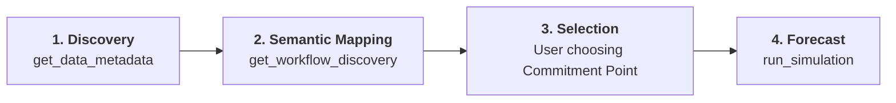
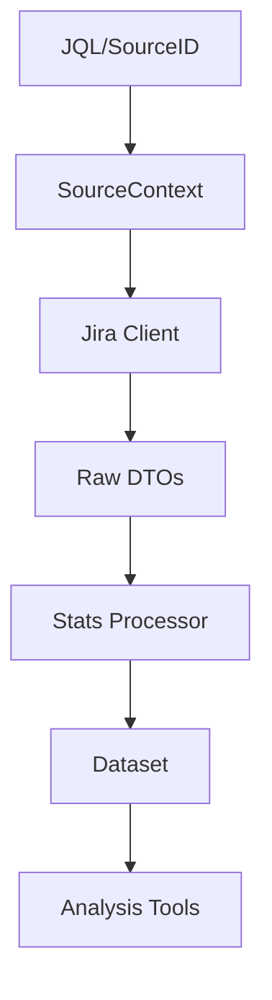

# Project Charter: MCS-MCP (Monte-Carlo Simulation Model Context Protocol)

## 1. Project Overview

MCS-MCP is a Model Context Protocol (MCP) server that provides AI agents with sophisticated forecasting and diagnostic capabilities for software delivery projects. It specializes in Monte-Carlo Simulations (MCS) using historical Jira data to provide probabilistic delivery dates, bottleneck identification, and flow stability analysis.

## 2. Core Architectural Principles

### Data-Driven Probabilism

- **No Averages**: The system rejects single-point averages in favor of ranges and percentiles.
- **Monte-Carlo Focus**: All forecasts are derived from 10,000+ random trials using historical throughput distributions.
- **Simulation Resilience (Safety Brakes)**: To ensure system availability, simulations implement safety brakes (e.g., 20,000 day cap) and early-exit warnings when historical throughput is zero, preventing infinite loops or resource exhaustion in sparse data scenarios.

### Operational Flow (The Interaction Model)

1.  **Discovery Phase**: The `get_data_metadata` tool is used to probe the data source (board/filter).
2.  **Semantic Mapping Phase**: The `get_workflow_discovery` tool identifies the residence time and Jira categories. The user/AI maps statuses to **Meta-Workflow Tiers** (Demand, Upstream, Downstream) and **Functional Roles** (Active, Queue, Ignore) using `set_workflow_mapping`.
3.  **Selection Phase**: Based on the discovery results, the user selects the **Commitment Point**.
4.  **Forecast Phase**: The `run_simulation` tool is executed. Diagnostic tools respect the semantic tiers and roles to avoid misinterpreting the backlog or discovery phases as bottlenecks.

### Mandatory Workflow Verification (Inform & Veto)

To ensure conceptual integrity, the AI **must never assume** the semantic tiers or roles of a project. Before providing process diagnostics, the following loop is required:

1.  **AI Proposes**: Use `get_workflow_discovery` to present an inferred mapping (e.g., _"I've mapped 'Analysis' as Upstream"_).
2.  **Inform & Veto**: The AI informs the user of this mapping and provides an opportunity for a veto or correction.
3.  **Persistence**: The verified mapping is stored via `set_workflow_mapping`.

---

### Status-Granular Flow Model

The server employs high-fidelity residency tracking. Instead of calculating a single duration window, it parses the full Jira changelog to determine the **exact days** spent in every workflow step. This enables:

- **Range-based Metrics**: Subdividing cycle time (e.g., "Ready to Test" vs "UAT and Deploy").
- **Accurate Persistence**: Summing multiple sessions in the same status for "ping-pong" tickets.
- **Workflow Decoupling**: Commitment and Resolution points can be shifted dynamically without re-ingesting data.

---

### Workflow Semantic Tiers & Roles

To prevent the AI from misinterpreting administrative or storage stages as process bottlenecks, statuses are mapped to **Meta-Workflow Tiers** and specific **Roles**.

#### 1. Meta-Workflow Tiers

Every status belongs to one of four logical process layers:

| Tier           | Meaning                                        | Commitment Insight                                                             |
| :------------- | :--------------------------------------------- | :----------------------------------------------------------------------------- |
| **Demand**     | High-level backlog (e.g., "Backlog").          | Items here are uncommitted and unrefined.                                      |
| **Upstream**   | Analysis and definition (e.g., "Refinement").  | Clock is running on "Discovery"; high delay indicates a definition bottleneck. |
| **Downstream** | Actual implementation (e.g., "In Dev", "UAT"). | The primary process flow; where implementation capacity is consumed.           |
| **Finished**   | Items that have exited the process.            | Terminal stage; used for throughput.                                           |

#### 2. Functional Roles

Within these tiers, statuses can be further tagged:

| Role       | Meaning                           | Impact on Analytics                                          |
| :--------- | :-------------------------------- | :----------------------------------------------------------- |
| **Active** | Primary working stage.            | High residence here indicates a process bottleneck.          |
| **Queue**  | Passive waiting stage (Hand-off). | Persistence is flagged as "Flow Debt" or "Waiting Waste".    |
| **Ignore** | Administrative stage.             | Resident time is excluded from core cycle time calculations. |

#### 3. Abandonment & Outcome

The server distinguishes **how** and **where** work exits the process:

- **Outcome: Delivered**: Item reached "Finished" from "Downstream" with a positive resolution.
- **Outcome: Abandoned**: Item reached "Finished" with a negative resolution (Discard, Won't Do).
- **Yield Analysis**: By tracking where abandonment happens (**from Demand**, **from Upstream**, or **from Downstream**), the server calculates the "Yield Rate" of the process.

---

### Standardized Percentile Mapping

To ensure consistency and help non-statistical users interpret results, the server uses a standardized mapping of percentiles to "Human-Language" names across all tools (Simulations, Inventory Aging, Persistence).

| Naming           | Statistical Percentile | Meaning                                                 |
| :--------------- | :--------------------- | :------------------------------------------------------ |
| **Aggressive**   | P10                    | Best-case outlier; "A miracle occurred."                |
| **Unlikely**     | P30                    | Very optimistic; depends on everything going perfectly. |
| **Coin Toss**    | P50                    | Median; 50/50 chance of being right or wrong.           |
| **Probable**     | P70                    | Reasonable level of confidence; standard for planning.  |
| **Likely**       | P85                    | High confidence; recommended for commitment.            |
| **Conservative** | P90                    | Very cautious; accounts for significant friction.       |
| **Safe-bet**     | P95                    | Extremely likely; includes heavy tail protection.       |
| **Limit**        | P98                    | The practical upper bound of historical data.           |

## 3. Technology Stack

- **Language**: Go (Golang)
- **Primary Algorithm**: Monte-Carlo Simulation (MCS)
- **Data Source**: Jira Software (Data Center or Cloud)
- **Communication**: Model Context Protocol (Standard)

## 4. Aging Math & Precision

To ensure conceptual integrity and transparency, the server adheres to a strict definition of "Age" and employs high-precision integer math for residency tracking.

#### 1. Precision & Storage

- **Internal Resolution**: The server parses Jira's changelog and calculates residence time for every status in **Seconds** (`int64`).
- **Serialization**: Integer seconds are used for all caching and cross-process communication to avoid floating-point "noise" and serialization errors.
- **Conversion**: Conversion to "Days" only occurs at the analytical or reporting boundary: `Days = float64(Seconds) / 86400.0`.

#### 2. Aging Definitions

The server distinguishes between two types of duration:

| Term           | Strict Definition                                                          | Usage                                      |
| :------------- | :------------------------------------------------------------------------- | :----------------------------------------- |
| **Status Age** | The time passed since the item entered its **current** workflow step.      | Bottleneck identification (Stage-specific) |
| **WIP Age**    | The time passed since the item crossed the **Commitment Point** (started). | Forecast reliability & stability analysis  |
| **Total Age**  | The time passed since the item was created in Jira.                        | Inventory hygiene & scope creep analysis   |

#### 3. Rounding & The "Zero-Day" Safeguard

To avoid confusing users with "0.0 days" (for items visited on the same day) and to ensure a clean UI without sacrificing simulation precision, the following logic is applied:

- **Reporting Precision**: All day-based metrics in tool outputs are rounded to **1 decimal place**.
- **The "Round-Up" Rule**: For current aging metrics (`StatusAge`, `WIPAge`), the server applies a ceiling-based rounding:
  $$Age_{Reported} = \frac{\lceil Age_{Float} \times 10 \rceil}{10}$$
- **Result**: Any item that has actually transitioned into a status will show at least **0.1 days**, never 0.0, while still allowing for fractional accuracy (e.g., 1.2 days).

#### 4. Existence of WIP Age

- An item strictly **does not have** a WIP Age before it crosses the commitment point.
- The server reports WIP Age as `null/nil` for items in the **Demand** tier or items that haven't transitioned into an **Active/Started** status yet.

#### 5. Backflow Policy

The system employs a strict "Restart on Backflow" policy for items returning to the **Demand** tier:

- **Reset**: If an item that has previously crossed the commitment point is moved back into a status mapped to the **Demand** tier, it is treated as a "Reset".
- **History Consolidation**: Instead of wiping history or resetting the **Created** date, the system consolidates all time spent prior to the most recent backflow into the **Demand** tier. This preserves the original **Total Age** while ensuring **WIP Age** reflects only the most recent start.
- **Fresh Start**: The item will only regain a WIP Age if and when it crosses the commitment point **again**. The new WIP Age will be calculated from this most recent crossing.
- **Rationale**: This prevents "stale WIP" metrics from being skewed by failed starts, while accurately reflecting that the item has been "known" (Total Age) since its true creation.

#### 6. History Fallback Policy

In cases where Jira data is incomplete (e.g., resolved items with missing or archived changelogs), the system applies a "Best Effort" residency model:

- **Residency Assumption**: If an item is resolved but has no transition history, the system assumes it spent its total duration in the "Created" status.
- **Analytical Inclusion**: This ensures these items are still included in throughput and total aging metrics, preserving the statistical volume of the dataset despite local data gaps.

---

### Volatility & Predictability Metrics

The server provides advanced statistical dispersion metrics to quantify the "stability" and "risk" of a process.

#### 1. Dispersion Metrics (The Spread)

| Metric        | Calculation | Meaning                                                                                                                       |
| :------------ | :---------- | :---------------------------------------------------------------------------------------------------------------------------- |
| **IQR**       | P75 - P25   | **Interquartile Range**: The density of the middle 50% of the data. Smaller IQR = higher predictability.                      |
| **Inner 80%** | P90 - P10   | **Robust Spread**: Shows the range where 80% of items fall. More robust than standard deviation for non-normal distributions. |

#### 2. Volatility Metrics (The Risk)

To identify process instability and the presence of extreme outliers (Fat-Tails), the server implements two key heuristics:

| Metric                   | Calculation | Stable Threshold | Indication of Failure                                                                                                                                      |
| :----------------------- | :---------- | :--------------- | :--------------------------------------------------------------------------------------------------------------------------------------------------------- |
| **Tail-to-Median Ratio** | P85 / P50   | **<= 3.0**       | **Highly Volatile**: If > 3.0, items in the high-confidence range (P85) take more than 3x the median time, indicating a heavy-tailed risk.                 |
| **Fat-Tail Ratio**       | P98 / P50   | **< 5.6**        | **Unstable / Out-of-Control**: Kanban University heuristic. If >= 5.6, extreme outliers are in control of the process, making forecasts highly unreliable. |

### 4.5. Process Stability & Evolution (XmR)

While Monte-Carlo simulations provide forecasts, Process Behavior Charts (XmR) assess the **validity** of those forecasts by identifying "Special Cause" variation.

#### The XmR Engine (Individual Chart)

The system employs Wheeler's XmR math (Individuals and Moving Range) to distinguish between:

- **Common Cause Variation (Noise)**: Inherent jitter within the Natural Process Limits (Avg +/- 2.66 \* AmR).
- **Special Cause Variation (Signal)**: Outliers (Rule 1) or Process Shifts (Rule 2: 8 consecutive points on one side).

#### Three-Way Process Behavior Charts

For longitudinal analysis (the "Strategic Audit"), the system uses Three-Way Charts:

1.  **Baseline Chart**: Monitors individual jitter.
2.  **Average Chart (The Third Way)**: Uses the moving range of _subgroup averages_ (e.g., Monthly averages) to detect long-term process drift or migration.

#### Integrated Time Analysis

A unique feature of the system is the integration of Done vs. WIP populations. Current **WIP Age** is monitored against the historical **UNPL** of resolved items, providing a proactive signal of instability _before_ the work is completed.

## 5. Data Ingestion & Analytical Decoupling

To enable multi-layer caching and improve conceptual integrity, the system strictly separates Jira-specific transportation from analytical processing.

### The Ingestion Pipeline

1.  **SourceContext**: Formally defines the origin of the data (SourceID, JQL, Primary Project). It serves as the "Analytical Anchor" for resolving default metadata (status weights, categories).
2.  **Raw DTOs (Data Transfer Objects)**: Pure, immutable structures representing the Jira JSON response. These are the primary targets for **Transport-Layer Caching**.
3.  **Dataset**: A cohesive analytical unit binding the `SourceContext` with processed domain `Issues`. This is the primary target for **Analytical-Layer Caching**.

### Chronological Processing (Residency Math)

By moving residency calculation out of the Jira client and into a dedicated `processor.go`, the system achieves:

- **Testability**: Analytics logic can be tested with mock DTOs without hitting a Jira server.
- **Flexibility**: Changes to backflow policies or aging precision can be re-applied to cached DTOs instantly.
- **Heterogeneous Support**: `Issue.ProjectKey` ensures accurate per-item logic even when a board spans multiple Jira projects.

---

## 6. Codebase Structure & Modularization

The codebase is designed for high cohesion and maintainability, with logic strictly separated by functional responsibility.

### `internal/jira` (The Transport Layer)

This package focuses exclusively on communication with Jira and raw data modeling.

- `client.go`: Interface definitions and domain models (`Issue`, `SourceContext`).
- `dc_client.go`: Implementation of the Jira Data Center / Server REST API.
- `dto.go`: Public Data Transfer Objects for JSON unmarshalling.

### `internal/stats` (The Analytical Engine)

This package contains the domain-specific statistical algorithms and transformation logic.

- `processor.go`: Centralized logic for mapping DTOs to Domain models and calculating status residency.
- `stability.go`: XmR charts, Three-Way Control Charts, and Integrated Time Analysis logic.
- `analyzer.go`: Foundational data types (`MetadataSummary`, `StatusMetadata`) and shared probe analysis logic.
- `persistence.go`: Logic for status persistence and residency distributions.
- `aging.go`: Implementations for WIP Aging and Total Aging analysis.
- `yield.go`: Calculations for process yield and abandonment waste.
- `cadence.go`: Logic for aggregating delivery throughput over time.

### `internal/mcp` (The Glue Layer)

This package handles the Model Context Protocol (MCP) server, tool registration, and request dispatching.

- `server.go`: The core server implementation and tool dispatching loop.
- `tools.go`: Definitions and AI-discoverable descriptions for all MCP tools.
- `handlers.go`: Top-level implementations for tool execution logic.
- `workflow.go`: Workflow-specific logic (residency rebuilding, backflow policies, and status weighting).
- `helpers.go`: General utility methods and type conversion helpers.

---

## 7. Conceptual Integrity Constraints

- **Cohesion**: Each tool must focus on a single aspect of flow (Ingestion, Simulation, Diagnostic).
- **Coherence**: Logical flow from data ingestion to statistical analysis to forecasting.
- **Consistency**: Adherence to Go community standards and naming conventions.
