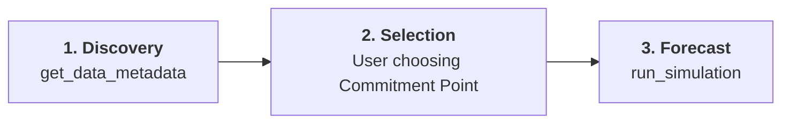

# Architecture Documentation

## Overview

The **MCS-MCP** project is an MCP (Model Context Protocol) Server designed to provide statistical forecasting capabilities (Monte-Carlo-Simulation) to AI assistants. It fetches historic data from Atlassian Jira and performs high-performance simulations in Go.

## Core Concepts

- **MCP Server**: Implemented in Go, communicating via Stdio.
- **Monte-Carlo-Simulation (MCS)**: Core forecasting logic.
- **Logging**: Dual sink approach using `zerolog`.
    - `Stderr`: Pretty-printed for CLI interaction and MCP debugging.
    - `logs/mcs-mcp.log`: Structured JSON with rotation (`lumberjack`).
- **Jira Integration**: Fetches work items using Jira REST API.
- **Interactive Selection**: The server provides metadata to the AI to help users select the right data sets and **Commitment Points** for forecasting.

## Operational Flow (Discovery → Selection → Forecast)

The server is designed to facilitate a specific, iterative interaction model between the AI assistant and the project stakeholders.

1.  **Discovery Phase**: The `get_data_metadata` tool is used to probe the data source (board/filter). It identifies data volume, quality issues, and—critically—discovers the project's unique workflow statuses.
2.  **Selection Phase**: Based on the discovery results, the AI presents the workflow to the user. The user selects the **Commitment Point** (where the "real" work starts) and the desired forecast mode.
3.  **Forecast Phase**: The `run_simulation` tool is executed with the chosen parameters. It uses the logical status sequence to handle WIP accounting and non-linear transitions accurately.

## Data Ingestion Model (Adaptive Windowing)

To handle the massive scale of projects and work items in a Jira Data Center environment, the server employs an **Adaptive Windowing** strategy for fetching historical data.

### 1. Goal: The "Target Sample"

The simulation requires a statistically significant amount of throughput data (defaults to **200 items**).

### 2. Throttled Discovery

- **Probe**: Every analysis starts with a small probe of the last 200 items to identify data quality (e.g., use of `resolutiondate` vs status transitions).
- **Throttling**: A mandatory **10-second delay** is enforced between every 1000-item page fetch to protect the Jira instance from overload.

### 3. Expansion Logic (Soft & Hard Limits)

- **Initial Window**: Starts by fetching metadata and items from the last **180 days**.
- **Adaptive Expansion**: If the result set is less than the Target Sample, the window expands (1 year, then 2 years) until the target is met.
- **Stop Condition**: Ingestion stops as soon as the Target Sample is reached, avoiding unnecessary load from deep historical data.
- **Hard Limit**: Ingestion unconditionally stops after **2 years** or **5000 items**. If the target isn't met by then, the server warns that the forecast confidence may be low.

## Forecasting Strategies

### 1. Throughput Calculation (Batch Forecasting)

Throughput-based simulations (Duration and Scope) resample the historical delivery rate.

- **WIP Accounting (Option A)**: Adds currently active items (Past Commitment Point, not Resolved) to the target backlog for realistic timelines.
- **Fresh Start (Option B)**: Ignores current work and assumes the new backlog starts immediately.

### 2. Cycle Time Analysis (Single-Item)

Calculates the distribution of time taken for individual items to pass through the workflow.

- **Logical Commitment Points**: The engine uses Jira's `statusCategory` to determine the progression (To Do -> In Progress -> Done).
- **Skip Detection**: The clock starts as soon as an item hits the user-defined `start_status` OR skips it to any status with an equal or higher logical weight (e.g., jumping from "To Do" straight to "In Verification").

### 3. Forecasting Confidence (Fat-Tail Detection)

The engine automatically assesses the predictability of the resulting forecast using Kanban University formulas.

- **Metric**: It calculates the ratio between the **98th percentile (P98)** and the **50th percentile (P50)**.
- **Rules of Thumb**:
    - **Stable (Thin-Tailed)**: Ratio < 5.6. High confidence in the forecast range.
    - **Unstable (Fat-Tailed)**: Ratio >= 5.6. Low confidence; the process is highly unpredictable, and extreme outliers are likely.

## Reliability & Confidence Layer

To move beyond simple "math" and provide high-integrity forecasts, the server implements "First Principle" checks to validate that the Monte Carlo assumptions hold true for the current system state.

> [!NOTE]
> Most depth-metrics (Aging, Stability, Reachability) require an explicit **Commitment Point** (`start_status`) to be provided.

### 1. Predictability Assessment (The "Fat-Tail" Check)

- **Mechanism**: Calculates the ratio between **P98** and **P50**.
- **Interpretation**:
    - **Ratio < 5.6**: Stable process. High confidence in the forecast range.
    - **Ratio >= 5.6**: **Fat-Tailed**. The process is unpredictable; outliers are the norm, not the exception. Traditional planning is high-risk.

### 2. WIP Aging Analysis (The "Honesty" Check)

- **Mechanism**: Calculates the age of all items currently past the Commitment Point.
- **Reference**: Compares current age against historical **P85/P95 Cycle Time** percentiles.
- **Warning**: Flags items that are "stale," signaling that current work is moving slower than the historical average used in the simulation.

### 3. Little's Law Stability Index (The "Capacity" Check)

- **Mechanism**: Calculates the **Stability Ratio** (`Current WIP / Expected WIP`).
- **Interpretation**:
    - **Balanced (0.8 - 1.2)**: System is in equilibrium.
    - **Clogged (> 1.3)**: System is overloaded. Lead times will likely increase regardless of simulation results.

### 4. Transition Reachability (The "Integrity" Check)

- **Mechanism**: Analyzes the percentage of historical items that actually passed through a given status.
- **Selection Support**: Helps avoid selecting "phantom" statuses that are frequently skipped in the real-world workflow.

---

### AI Implementation Guide: Interpreting Metrics

When consuming these metrics in a chat interface (like Claude or ChatGPT), the AI should follow these patterns:

| Signal                      | AI Observation                                                    | AI Recommendation                                                          |
| :-------------------------- | :---------------------------------------------------------------- | :------------------------------------------------------------------------- |
| **Fat-Tail (Ratio > 5.6)**  | "The math gives a date, but the process is highly unpredictable." | "Investigate common causes of outliers (blockers, scope creep)."           |
| **Clogged (Index > 1.3)**   | "The team is trying to do too much at once."                      | "Stop starting, start finishing. Reduce WIP to restore predictability."    |
| **Stale WIP (> 30% stale)** | "Current work is already falling behind historical speeds."       | "Prioritize the aging items before they further skew the delivery date."   |
| **Low Reachability**        | "The chosen Commitment Point is frequently skipped."              | "Switch the start status to a more reliable 'gate' like 'In Development'." |

## Project Structure

- `cmd/mcs-mcp`: Entry point and CLI/MCP command handling.
- `internal/`: Private implementation details of the forecasting and Jira logic.
- `pkg/`: Publicly reusable components (if any).
- `conf/`: Configuration templates and environment variable examples.
- `docs/`: Markdown documentation.

## Design Principles

- **Cohesion**: Each module focuses on a single responsibility (e.g., Jira data fetching vs. MCS logic).
- **Coherence**: Logical flow from data ingestion to statistical analysis to forecasting.
- **Consistency**: Adherence to Go community standards and naming conventions.
