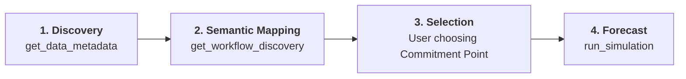

# Project Charter: MCS-MCP (Monte-Carlo Simulation Model Context Protocol)

## 1. Project Overview

MCS-MCP is a Model Context Protocol (MCP) server that provides AI agents with sophisticated forecasting and diagnostic capabilities for software delivery projects. It specializes in Monte-Carlo Simulations (MCS) using historical Jira data to provide probabilistic delivery dates, bottleneck identification, and flow stability analysis.

## 2. Core Architectural Principles

### Data-Driven Probabilism

- **No Averages**: The system rejects single-point averages in favor of ranges and percentiles.
- **Monte-Carlo Focus**: All forecasts are derived from 10,000+ random trials using historical throughput distributions.

### Operational Flow (The Interaction Model)

1.  **Discovery Phase**: The `get_data_metadata` tool is used to probe the data source (board/filter).
2.  **Semantic Mapping Phase**: The `get_workflow_discovery` tool identifies the residence time and Jira categories. The user/AI maps statuses to **Meta-Workflow Tiers** (Demand, Upstream, Downstream) and **Functional Roles** (Active, Queue, Ignore) using `set_workflow_mapping`.
3.  **Selection Phase**: Based on the discovery results, the user selects the **Commitment Point**.
4.  **Forecast Phase**: The `run_simulation` tool is executed. Diagnostic tools respect the semantic tiers and roles to avoid misinterpreting the backlog or discovery phases as bottlenecks.

### Mandatory Workflow Verification (Inform & Veto)

To ensure conceptual integrity, the AI **must never assume** the semantic tiers or roles of a project. Before providing process diagnostics, the following loop is required:

1.  **AI Proposes**: Use `get_workflow_discovery` to present an inferred mapping (e.g., _"I've mapped 'Analysis' as Upstream"_).
2.  **Inform & Veto**: The AI informs the user of this mapping and provides an opportunity for a veto or correction.
3.  **Persistence**: The verified mapping is stored via `set_workflow_mapping`.

---

### Status-Granular Flow Model

The server employs high-fidelity residency tracking. Instead of calculating a single duration window, it parses the full Jira changelog to determine the **exact days** spent in every workflow step. This enables:

- **Range-based Metrics**: Subdividing cycle time (e.g., "Ready to Test" vs "UAT and Deploy").
- **Accurate Persistence**: Summing multiple sessions in the same status for "ping-pong" tickets.
- **Workflow Decoupling**: Commitment and Resolution points can be shifted dynamically without re-ingesting data.

---

### Workflow Semantic Tiers & Roles

To prevent the AI from misinterpreting administrative or storage stages as process bottlenecks, statuses are mapped to **Meta-Workflow Tiers** and specific **Roles**.

#### 1. Meta-Workflow Tiers

Every status belongs to one of four logical process layers:

| Tier           | Meaning                                        | Commitment Insight                                                             |
| :------------- | :--------------------------------------------- | :----------------------------------------------------------------------------- |
| **Demand**     | High-level backlog (e.g., "Backlog").          | Items here are uncommitted and unrefined.                                      |
| **Upstream**   | Analysis and definition (e.g., "Refinement").  | Clock is running on "Discovery"; high delay indicates a definition bottleneck. |
| **Downstream** | Actual implementation (e.g., "In Dev", "UAT"). | The primary process flow; where implementation capacity is consumed.           |
| **Finished**   | Items that have exited the process.            | Terminal stage; used for throughput.                                           |

#### 2. Functional Roles

Within these tiers, statuses can be further tagged:

| Role       | Meaning                           | Impact on Analytics                                          |
| :--------- | :-------------------------------- | :----------------------------------------------------------- |
| **Active** | Primary working stage.            | High residence here indicates a process bottleneck.          |
| **Queue**  | Passive waiting stage (Hand-off). | Persistence is flagged as "Flow Debt" or "Waiting Waste".    |
| **Ignore** | Administrative stage.             | Resident time is excluded from core cycle time calculations. |

#### 3. Abandonment & Outcome

The server distinguishes **how** and **where** work exits the process:

- **Outcome: Delivered**: Item reached "Finished" from "Downstream" with a positive resolution.
- **Outcome: Abandoned**: Item reached "Finished" with a negative resolution (Discard, Won't Do).
- **Yield Analysis**: By tracking where abandonment happens (**from Demand**, **from Upstream**, or **from Downstream**), the server calculates the "Yield Rate" of the process.

---

### Standardized Percentile Mapping

To ensure consistency and help non-statistical users interpret results, the server uses a standardized mapping of percentiles to "Human-Language" names across all tools (Simulations, WIP Aging, Persistence).

| Naming           | Statistical Percentile | Meaning                                                 |
| :--------------- | :--------------------- | :------------------------------------------------------ |
| **Aggressive**   | P10                    | Best-case outlier; "A miracle occurred."                |
| **Unlikely**     | P30                    | Very optimistic; depends on everything going perfectly. |
| **Coin Toss**    | P50                    | Median; 50/50 chance of being right or wrong.           |
| **Probable**     | P70                    | Reasonable level of confidence; standard for planning.  |
| **Likely**       | P85                    | High confidence; recommended for commitment.            |
| **Conservative** | P90                    | Very cautious; accounts for significant friction.       |
| **Safe-bet**     | P95                    | Extremely likely; includes heavy tail protection.       |
| **Limit**        | P98                    | The practical upper bound of historical data.           |

## 3. Technology Stack

- **Language**: Go (Golang)
- **Primary Algorithm**: Monte-Carlo Simulation (MCS)
- **Data Source**: Jira Software (Data Center or Cloud)
- **Communication**: Model Context Protocol (Standard)

## 4. Conceptual Integrity Constraints

- **Cohesion**: Each tool must focus on a single aspect of flow (Ingestion, Simulation, Diagnostic).
- **Coherence**: Logical flow from data ingestion to statistical analysis to forecasting.
- **Consistency**: Adherence to Go community standards and naming conventions.
