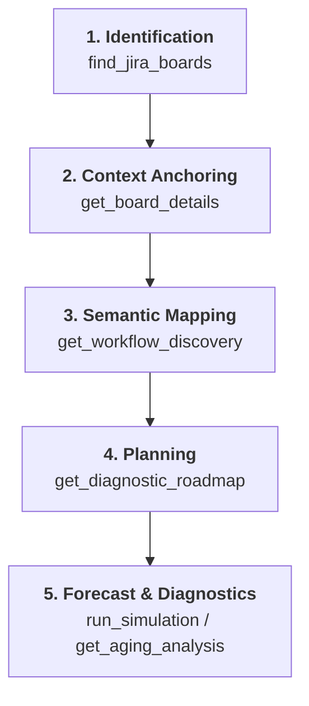
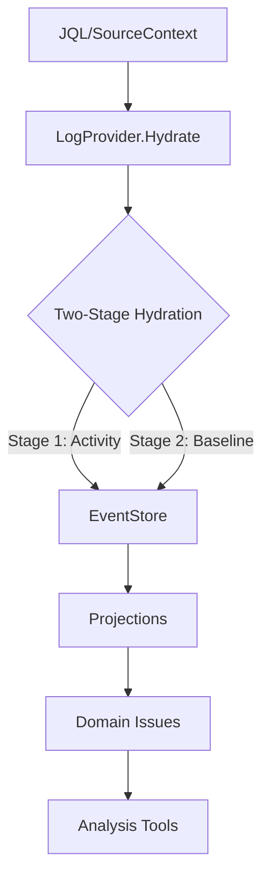

# Project Charter: MCS-MCP (Monte-Carlo Simulation Model Context Protocol)

## 1. Project Overview

MCS-MCP is a Model Context Protocol (MCP) server that provides AI agents with sophisticated forecasting and diagnostic capabilities for software delivery projects. It specializes in Monte-Carlo Simulations (MCS) using historical Jira data to provide probabilistic delivery dates, bottleneck identification, and flow stability analysis.

## 2. Core Architectural Principles

### Observation-Driven Analytics (Data Archeology)

- **Metadata Independence**: The system rejects reliance on Jira-specific metadata like `statusCategory`, which is often misconfigured or inconsistent.
- **Fact-Based Discovery**: Workflow semantics are inferred from objective facts in the transition log:
    - **Birth Status**: The earliest entry point identifies the system's source of demand.
    - **Terminal Sinks**: Statuses showing high entry but low exit ratios identify logical completion points even when resolutions are missing.
    - **Backbone Order**: The "Happy Path" is derived from the most frequent sequence of transitions.
    - **Unified Regex Stemming**: Discovery logic used capturing groups to both categorize roles (Queue/Active) and extract a normalized "stem" for pair identification, ensuring that "Ready for Test" and "Testing" are semantically linked via their shared core.
- **Robust ID-Based Mapping**: The system prioritizes Jira `StatusID` for all workflow mapping and analytical lookups, falling back to case-insensitive name matching only when IDs are unavailable. This ensures consistency even if statuses are renamed (ping-ponging between names and IDs) or mappings are provided via external agent interactions with inconsistent casing.
- **Workflow Normalization**: Discovery and exploratory tools (`AnalyzeProbe`, `DiscoverStatusOrder`) perform early normalization of status names to a "canonical" casing (the first one encountered). This prevent data fragmentation where "Done" and "DONE" would otherwise be treated as distinct workflow steps.

### Operational Flow (The Interaction Model)



1.  **Identification Phase**: Use `find_jira_projects` and `find_jira_boards` to locate the target. Guidance automatically triggers the next step.
2.  **Context Anchoring Phase**: Use `get_board_details` (or `get_project_details`). This tool performs an **Eager Fetch** of history and produces a **Data Shape Anchor**. It clarifies the difference between `totalIngestedIssues` (the cached history size) and the `discoverySampleSize` (the recent healthy subset used for heuristics).
3.  **Semantic Mapping Phase**: Use `get_workflow_discovery` to establish tiers and roles via **Data Archeology**. It utilizes the `identifiedStatusesFromSample` list for status identification.
4.  **Planning Phase**: Use `get_diagnostic_roadmap` to align with the user's goal (e.g., "forecasting", "bottlenecks"). This provides the recommended sequence of analytical tools based on the now-confirmed context.
5.  **Analytics Phase**: Perform high-fidelity diagnostics (Aging, Stability, Simulation) using the established mapping and baseline. **Mandatory Dual-Anchor Steering**: All analytical tools require both `project_key` and `board_id` to ensure analysis is performed against a confirmed project/board context.
    - Diagnostic tools respect the semantic tiers and roles to avoid misinterpreting the backlog or discovery phases as bottlenecks.

### Analytical Roadmap (AI Guidance)

To ensure the AI Agent selects the most reliable path for complex goals, the server provides a `get_diagnostic_roadmap` tool. This tool acts as an "Analytical Orchestrator," recommending a specific order of diagnostic steps:

- **Analytical Orchestrator**: Provides tailored workflows for `forecasting`, `bottlenecks`, `capacity_planning`, and `system_health`.
- **System Visibility & Transparency**:
    - **Approval Signals**: `get_workflow_discovery` provides an `is_cached` flag, enabling agents to distinguish between newly proposed heuristics and user-approved, persisted mappings.
    - **Date-Aware Cadence**: `get_delivery_cadence` maps relative week numbers to actual ISO date ranges via `@week_metadata`, providing clear temporal context for throughput trends.
- **Prerequisite Enforcement**: Explicitly guides the AI to perform foundational steps (like stability checks or workflow verification) before running high-level simulations.

### Mandatory Workflow Verification (Inform & Veto)

To ensure conceptual integrity, the AI **must never assume** the semantic tiers or roles of a project. Before providing process diagnostics, the following loop is required:

1.  **AI Proposes**: Use `get_workflow_discovery` to present an inferred mapping. The server utilizes **Pure Observation** (archeology):
    - **Demand Tier**: Status identified as the primary entry point (`birthStatus`).
    - **Finished Tier**: Statuses with a high **Resolution Density** (Fact-based, > 20%) or identified as a **Terminal Sink** (Asymmetry-based).
    - **Confidence-Weighted Backbone**: The path tracer avoids premature "shortcuts" to terminal states by requiring transitions to meet a **Market Share** threshold (15%) and prioritizing active workflow chains.
    - **Backflow Weighting**: Backflow detection (reverting to a 'lower' status) is based on the **Observed Backbone Path Index**, not system categories.
    - **Functional Roles**: Automatic "queue" role for statuses matching patterns like "Ready for X" or "Awaiting" when an active counterpart exists.
    - **API Strategy**: The server intentionally avoids the Jira Board Configuration API (`/rest/agile/1.0/board/{id}/configuration`) for several reasons:
        - **Deprecation Risk**: The endpoint is not present in Jira REST API versions 2.0 and 3.0, indicating it may be removed or replaced.
        - **Structural Mismatch**: Board columns often group multiple statuses or use names that diverge from the underlying workflow, which would require complex resolution logic (like the `/status` endpoint) to maintain cohesion.
        - **Cognitive Load**: Mapping board-specific visualization metadata to universal process tiers might introduce unnecessary complexity and potentially confuse AI agents during analysis.

---

### Status-Granular Flow Model

The server employs high-fidelity residency tracking. Instead of calculating a single duration window, it parses the full Jira changelog to determine the **exact days** spent in every workflow step. This enables:

- **Range-based Metrics**: Subdividing cycle time (e.g., "Ready to Test" vs "UAT and Deploy").
- **Accurate Persistence**: Summing multiple sessions in the same status for "ping-pong" tickets.
- **Workflow Decoupling**: Commitment and Resolution points can be shifted dynamically without re-ingesting data.

---

### Workflow Semantic Tiers & Roles

To prevent the AI from misinterpreting administrative or storage stages as process bottlenecks, statuses are mapped to **Meta-Workflow Tiers** and specific **Roles**.

### Throttling & Burst Mode Policy

To maintain a high-performance experience during the multi-step discovery process while protecting Jira Data Center from excessive load:

- **Safety Brake**: Heavy analytical queries (Search with History, JQL Hydration) are subject to `JIRA_REQUEST_DELAY_SECONDS` (default: 10s).
- **Burst Mode**: "Cheap" metadata requests (Get Board, Get Config, Get Project Statuses) bypass the artificial throttle when executed sequentially.
- **Delta Sync Bypass**: Incremental hydration (syncing changes since a valid cache timestamp) remains sequential but processes all paged results without artificial caps, ensuring a complete log.
- **Paging Optimization**: Hydration utilizes a `BatchSize` of 200 items per request and an optimized 2-second "paging floor" to balance ingestion speed with API safety.
- **Result**: Automated discovery chains (Find -> Details -> Mapping) feel immediate, while analytical workloads remain governed.

#### 1. Meta-Workflow Tiers

Every status belongs to one of four logical process layers:

| Tier           | Meaning                                                      | Commitment Insight                                                                          | Clock Behavior                                                                 |
| :------------- | :----------------------------------------------------------- | :------------------------------------------------------------------------------------------ | :----------------------------------------------------------------------------- |
| **Demand**     | Initial entry point to the system (e.g., "Backlog", "Open"). | Items here are uncommitted and unrefined. Identifies the primary "Source of Demand".        | Clock is pending; residency is stored but doesn't contribute to WIP.           |
| **Upstream**   | Analysis and refinement (e.g., "Refining").                  | Clock is running on "Discovery"; items in "To Do" category but NOT the primary entry point. | Active clock.                                                                  |
| **Downstream** | Actual implementation (e.g., "In Dev", "UAT").               | The primary process flow; where implementation capacity is consumed.                        | Active clock.                                                                  |
| **Finished**   | Items that have exited the process.                          | Terminal stage; used for throughput.                                                        | **Clock Stops**: Pin residency at entry point. Age becomes fixed "Cycle Time". |

#### 2. Functional Roles

Within these tiers, statuses can be further tagged:

| Role         | Meaning                           | Impact on Analytics                                          |
| :----------- | :-------------------------------- | :----------------------------------------------------------- |
| **Active**   | Primary working stage.            | High residence here indicates a process bottleneck.          |
| **Queue**    | Passive waiting stage (Hand-off). | Persistence is flagged as "Flow Debt" or "Waiting Waste".    |
| **Terminal** | Finished/Resolution stage.        | Explicitly stops the aging clock and pins duration.          |
| **Ignore**   | Administrative stage.             | Resident time is excluded from core cycle time calculations. |

#### 3. Abandonment & Outcome

The server distinguishes **how** and **where** work exits the process through **Workflow Outcome Calibration**. Because Jira workflows are often inconsistent, the server employs a dual-signal methodology:

- **The "Finished" Signal**: Detection of the terminal state.
    - **Primary (Probabilistic Fact)**: A status is terminal if a significant portion (> 20%) of its visitors are resolved there.
    - **Secondary (Asymmetry)**: Detection of a **Terminal Sink** (Status where entries significantly exceed exits).
    - **Tertiary (Mapping)**: Reaching a status explicitly mapped to the **Finished** tier.
- **Outcome Classification**: Once finished, items are classified into semantic outcomes:
    - **Outcome: Delivered**: Item reached "Finished" with a resolution or status outcome mapped as value-providing (e.g., "Fixed", "Done"). This is the only population used for **Throughput** and **Simulation**.
    - **Outcome: Abandoned**: Item reached "Finished" with a resolution or status outcome mapped as waste (e.g., "Won't Do", "Discarded").
- **Yield Analysis**: The server calculates the "Yield Rate" by attributing abandonment to specific workflow tiers:
    - **Explicit Attribution**: Uses outcome suffixes (e.g., `abandoned_upstream`, `abandoned_downstream`) defined in the calibration layer.
    - **Heuristic Attribution**: Falls back to backtracking the last status before entering terminal state if the outcome is generically marked as `abandoned`.

---

### Standardized Percentile Mapping

To ensure consistency and help non-statistical users interpret results, the server uses a standardized mapping of percentiles to "Human-Language" names across all tools (Simulations, Inventory Aging, Persistence).

| Naming           | Statistical Percentile | Meaning                                                 |
| :--------------- | :--------------------- | :------------------------------------------------------ |
| **Aggressive**   | P10                    | Best-case outlier; "A miracle occurred."                |
| **Unlikely**     | P30                    | Very optimistic; depends on everything going perfectly. |
| **Coin Toss**    | P50                    | Median; 50/50 chance of being right or wrong.           |
| **Probable**     | P70                    | Reasonable level of confidence; standard for planning.  |
| **Likely**       | P85                    | High confidence; recommended for commitment.            |
| **Conservative** | P90                    | Very cautious; accounts for significant friction.       |
| **Safe-bet**     | P95                    | Extremely likely; includes heavy tail protection.       |
| **Limit**        | P98                    | The practical upper bound of historical data.           |

## 3. Technology Stack

- **Language**: Go (Golang)
- **Primary Algorithm**: Monte-Carlo Simulation (MCS)
- **Data Source**: Jira Software (Data Center or Cloud)
- **Communication**: Model Context Protocol (Standard)
- **Transport Layer**: Stdio with `json.NewDecoder` for asynchronous, newline-independent message processing, ensuring zero-latency response times in complex host environments (e.g., Claude Desktop).

## 4. Aging Math & Precision

To ensure conceptual integrity and transparency, the server adheres to a strict definition of "Age" and employs high-precision integer math for residency tracking.

#### 1. Precision & Storage

- **Internal Resolution**: The server parses Jira's changelog and calculates events in **Microseconds** (`int64`) for precise sequencing in the event log.
- **Residency Resolution**: For statistical analysis and residency tracking (e.g., time spent in a status), the server uses **Seconds** (`int64`). This simplifies calculations while maintaining sufficient precision for project-level forecasting.
- **Serialization**: Integer microseconds are used for event timestamps to ensure a deterministic "Physical Identity" for events and simplify deduplication.
- **Conversion**: Conversion to "Days" occurs at the analytical or reporting boundary: `Days = float64(Seconds) / 86400.0`.
- **Resolution Date Synchronization**: If a `resolution` is set or cleared in a change-set, the associated `resolutionDate` (with potentially lower clock precision) is synchronized with the change-set timestamp to maintain process integrity.

#### 2. Aging Definitions

The server distinguishes between two types of duration:

| Term           | Strict Definition                                                            | Usage                                                                           |
| :------------- | :--------------------------------------------------------------------------- | :------------------------------------------------------------------------------ |
| **Status Age** | The time passed since the item entered its **current** workflow step.        | Bottleneck identification (Active/In-flight). Fixed at 0.0 for terminal items.  |
| **WIP Age**    | The time passed since the item crossed the **Commitment Point** (started).   | Forecast reliability & stability analysis. Only applies to Upstream/Downstream. |
| **Cycle Time** | The **pinned duration** of an item from commitment to the **Finished** tier. | Historical baseline & capability analysis. Represents "Finished Age".           |
| **Total Age**  | The time passed since the item was created in Jira.                          | Inventory hygiene. Pins at entry to "Finished" tier.                            |

#### 3. Rounding & The "Zero-Day" Safeguard

To avoid confusing users with "0.0 days" (for items visited on the same day) and to ensure a clean UI without sacrificing simulation precision, the following logic is applied:

- **Reporting Precision**: All day-based metrics in tool outputs are rounded to **1 decimal place**.
- **The "Round-Up" Rule**: For current aging metrics (`StatusAge`, `WIPAge`), the server applies a ceiling-based rounding:
  $$Age_{Reported} = \frac{\lceil Age_{Float} \times 10 \rceil}{10}$$
- **Result**: Any item that has actually transitioned into a status will show at least **0.1 days**, never 0.0, while still allowing for fractional accuracy (e.g., 1.2 days).

#### 4. Existence of WIP Age

- An item strictly **does not have** a WIP Age before it crosses the commitment point.
- The server reports WIP Age as `null/nil` for items in the **Demand** tier or items that haven't transitioned into an **Active/Started** status yet.

#### 5. Backflow and Un-Resolution Policy

The system employs a multi-layered strategy for items returning to active work from a terminal state (Backflow) or having their resolution explicitly removed (Un-Resolution):

- **Capture (Case 1: Explicit Clear)**: If the Jira `resolution` field is explicitly cleared in history, the transformer emits an `Unresolved` event. This provides a high-fidelity "Birth Date" for the new active period.
- **Reactive Projection (Case 2 & 3: Inconsistent Data)**: Projections are designed to be status-reactive. If a transition moves an item from a terminal status back to an active one, the projection automatically unsets the internal `ResolutionDate` and `Resolution` fields, regardless of whether they were cleared in Jira's snapshot data.
- **Reset on Backflow**: If an item returns to the **Demand** tier, it is treated as a "Reset":
    - **History Consolidation**: Time spent prior to the backflow is consolidated into the Demand tier, preserving **Total Age**.
    - **Fresh Start**: **WIP Age** reflects only the most recent commitment crossing.

#### 6. Project Move Boundary

To ensure conceptual integrity in cross-project environments (e.g., items moving from "Strategy" projects to "Delivery" projects), the system implements a process boundary for project moves:

- **Move Detection**: If an item's history shows a change in the `Key` or `project` fields, the system treats the latest move date as a **Process Boundary**.
- **Contextual Reset**: All `StatusResidency` and `Transitions` that occurred _under a different project key_ are discarded during analysis. This ensures that Workflow Discovery and process diagnostics accurately reflect only the current project's flow.
- **Tier Discovery Integrity**: Moved items are **discarded during 'Demand' tier discovery**. This prevents mid-process entry points (transferring an item into "Developing" in the new project) from being mis-detected as a system-wide source of demand.
- **Lead Time Preservation**: Critically, the original `Created` date is preserved. High-level metrics like **Total Age** remain valid, reflecting the item's entire lifecycle from original idea to delivery, while low-level process metrics (WIP Age, Status Persistence) are cleaned of "ghost" statuses from older projects.

#### 7. Terminal Pinning Policy (Stop the Clock)

To prevent archive data from skewing delivery metrics, the system implements a "Stop the Clock" policy for terminal statuses:

- **Pinned Residency**: When an item enters a status mapped to the **Finished** tier or a **Terminal** role, the residency calculation for that status (and the total process age) is pinned to the point of entry (or the resolution date if available).
- **Cycle Time vs Aging**: Items in terminal statuses cease to "age". Their calculated duration is treated as a fixed **Cycle Time**.
- **WIP Exclusion**: Diagnostic tools like `get_aging_analysis` can explicitly filter out "Finished/Terminal" items to ensure the focus remains on the active inventory (WIP).
- **Data Integrity**: This policy ensures that items delivered 6 months ago don't show an "Age" of 180 days in aging reports; they show the exact number of days they took to complete.

#### 7. History Fallback Policy

In cases where Jira data is incomplete (e.g., resolved items with missing or archived changelogs), the system applies a "Best Effort" residency model via the **Transformer**:

- **Birth Status Alignment**: The system automatically identifies the functional land-status (e.g., 'Open') for the creation event by analyzing the earliest available transition.
- **Residency Assumption**: If an item is resolved but has no transition history, the system assumes it spent its total duration in its birth status.
- **Analytical Inclusion**: This ensures these items are still included in throughput and total aging metrics, preserving the statistical volume of the dataset despite local data gaps.

---

### Volatility & Predictability Metrics

The server provides advanced statistical dispersion metrics to quantify the "stability" and "risk" of a process.

#### 1. Dispersion Metrics (The Spread)

| Metric        | Calculation | Meaning                                                                                                                       |
| :------------ | :---------- | :---------------------------------------------------------------------------------------------------------------------------- |
| **IQR**       | P75 - P25   | **Interquartile Range**: The density of the middle 50% of the data. Smaller IQR = higher predictability.                      |
| **Inner 80%** | P90 - P10   | **Robust Spread**: Shows the range where 80% of items fall. More robust than standard deviation for non-normal distributions. |

#### 2. Volatility Metrics (The Risk)

To identify process instability and the presence of extreme outliers (Fat-Tails), the server implements two key heuristics:

| Metric                   | Calculation | Stable Threshold | Indication of Failure                                                                                                                                      |
| :----------------------- | :---------- | :--------------- | :--------------------------------------------------------------------------------------------------------------------------------------------------------- |
| **Tail-to-Median Ratio** | P85 / P50   | **<= 3.0**       | **Highly Volatile**: If > 3.0, items in the high-confidence range (P85) take more than 3x the median time, indicating a heavy-tailed risk.                 |
| **Fat-Tail Ratio**       | P98 / P50   | **< 5.6**        | **Unstable / Out-of-Control**: Kanban University heuristic. If >= 5.6, extreme outliers are in control of the process, making forecasts highly unreliable. |

#### 3. Throughput Collapse & Representative Sampling

To prevent "naïve" simulations from producing nonsensical dates (e.g., forecasting 15 years for a 2-week backlog), the engine implements **Integrity Thresholds**:

- **Throughput Collapse Barrier**: If the median simulation result exceeds 10 years, the system issues a `WARNING`. This identifies scenarios where the combined filter of `issue_types` and `resolutions` has reduced the historical sample size so much that individual outliers dominate the result.
- **Resolution Density Check**: The system monitors the ratio of "Delivered" items vs. "Dropped" items (items resolved but excluded by the user's resolution filter). If **Resolution Density < 20%**, a `CAUTION` flag is raised, warning that the throughput baseline may be unrepresentative of actual system capacity.

### 4.5. Hybrid Simulation Model (Capability + Reality)

Unlike standard Monte-Carlo tools that rely solely on historical throughput sampling, MCS-MCP utilizes a **Hybrid Simulation Model**. This model integrates three distinct analytical layers to produce high-fidelity forecasts:

#### 1. Statistical Capability (The Histogram)

The engine builds a probabilistic distribution of system capacity by analyzing **Delivered-Only** outcomes within a sliding historical window.

- **Outcome-Aware**: Throughput ignores "Abandoned" work (junk/noise) to ensure the simulation baseline reflects actual value-providing velocity.
- **Slot-Based Sampling**: The engine models total system capacity. In each trial, delivery slots are assigned work item types based on the observed historical mix (e.g., 60% Stories, 30% Bugs).

#### 2. Current Reality (WIP Stability Analysis)

The simulation doesn't treat Work-In-Progress (WIP) as "unstarted" items. It explicitly analyzes the **Stability of in-flight work**:

- **WIP Age vs. Capability**: The system compares the current age of every WIP item against the historical Natural Process Limits (UNPL).
- **Early Outlier Detection**: Items that have aged past the P85 or P95 historical benchmarks are flagged as "Stale" or "Extreme Outliers" within the simulation insights.
- **WIP Momentum**: The engine leverages WIP Age to detect if a system is "clogged" before it affects the throughput charts.

#### 3. Demand Expansion (Hidden Friction)

To handle realistic scenarios where background work (e.g., Bugs, Administrative Tasks) consumes team capacity, the system utilizes **Slot-based Demand Expansion**:

- **Background Item Modeling**: If a sampled slot yields a type NOT requested in the forecast targets, it is treated as **Background Work**. It consumes a slot but does not progress the project goal.
- **Strategic Insight**: This model naturally produces longer, more realistic forecasts that account for the friction of background noise without requiring manual estimation.

#### 4. Diagnostic Indicators

The simulation result object includes high-fidelity system health signals:

- **Clogged System Index**: The ratio of current WIP to historical weekly throughput. If WIP significantly exceeds historical capacity, the system warns of imminent lead-time inflation.
- **Stale WIP Warning**: Counts items currently in progress that are older than the historical 85th percentile (Likely) completion time.
- **Throughput Decay**: Detects systemic performance shifts by comparing the long-term historical baseline to the recent 30-day "pulse".

#### 5. Capacity Overrides (What-if Analysis)

Users can apply `mix_overrides` to shift the historical distribution (e.g., "What if we spend 20% more time on Bugs?"). The engine re-normalizes capacity proportionally, allowing for rapid scenario planning.

### 2.6 Dynamic Sampling Windows

To ensure that the historical baseline reflects the expected future context (e.g., avoiding low-throughput holiday periods or focusing on a specific project phase), the system allows **baseline shifting**:

- **Sliding Windows**: Users can specify `sample_days` (e.g., "last 30 days") to focus only on recent performance. Analytical tools strictly enforce these windows at the resolution date level to ensure chronological sensitivity.
- **Explicit Fixed Windows**: Users can define `sample_start_date` and `sample_end_date` (e.g., "use entire month of November") to capture a specific behavior pattern as the forecast engine.
- **Sensitivity Enforcement**: Statistical aggregations (Throughput, Monthly Subgroups) utilize precise filtering to ensure that system drifts or seasonal patterns are not masked by overlapping stale data.
- **AI-Driven Baseline Selection**: AI agents are instructed to analyze process stability (`get_process_stability`) before selecting a sampling window to ensure the baseline itself is "in control."
- **Rational Subgrouping (Current Month Filter)**: Long-term trend analysis (`get_process_evolution`) automatically excludes the current calendar month. This prevents "partial data skew" where an incomplete month's throughput or lead time artificially compresses the Natural Process Limits, creating false alarms.

---

### 4.5. Process Stability & Evolution (XmR)

While Monte-Carlo simulations provide forecasts, Process Behavior Charts (XmR) assess the **validity** of those forecasts by identifying "Special Cause" variation.

#### The XmR Engine (Individual Chart)

The system employs Wheeler's XmR math (Individuals and Moving Range) to distinguish between:

- **Common Cause Variation (Noise)**: Inherent jitter within the Natural Process Limits (Avg +/- 2.66 \* AmR).
- **Special Cause Variation (Signal)**: Outliers (Rule 1) or Process Shifts (Rule 2: 8 consecutive points on one side).

#### Three-Way Process Behavior Charts

For longitudinal analysis (the "Strategic Audit"), the system uses Three-Way Charts:

1.  **Baseline Chart**: Monitors individual jitter.
2.  **Average Chart (The Third Way)**: Uses the moving range of _subgroup averages_ (e.g., Monthly averages) to detect long-term process drift or migration.

#### Integrated Time Analysis

A unique feature of the system is the integration of Done vs. WIP populations. Current **WIP Age** is monitored against the historical **UNPL** of resolved items, providing a proactive signal of instability _before_ the work is completed.

## 5. Event-Sourced Architecture & Staged Ingestion

To enable high-fidelity metrics and progressive data loading, the system utilizes an **Event-Sourced Architecture**. Instead of treating Jira issues as static snapshots, the server maintains a chronological log of atomic events for every work item.

#### The Event-Sourced Pipeline



1.  **LogProvider**: Orchestrates the data flow. It ensures that the required level of data detail is available in the local log via an **Eager Fetch** policy triggered upon board/filter selection.
2.  **Two-Stage Hydration**:
    - **Stage 1: Recent Activity & WIP**: Fetches items sorted by `updated DESC` to ensure all active WIP and recent delivery history (up to 1000 items or 1 year) are captured immediately.
    - **Stage 2: Baseline Depth**: If the first stage did not yield enough resolved items for a statistically significant baseline (default 200 items), the system performs an explicit fetch for historical resolutions (`resolution is not EMPTY`).
3.  **EventStore**: A thread-safe, chronological repository of `IssueEvents`. It handles deduplication and strictly orders events by **Timestamp** (Unix Microseconds). Identity for deduplication includes all relevant signals (Status, Resolution, Move, Unresolve) to ensure atomic change-sets are preserved.
4.  **Transformer**: Converts Jira's snapshot DTOs and changelogs into atomic events (`Created`, `Change`). It packs multiple field updates (status, resolution) from a single Jira history entry into a single `Change` event. It utilizes a **2-second grace period** to deduplicate resolution signals between snapshots and history.
5.  **Projections**: Reconstructs domain logic (like `jira.Issue` or `ThroughputBuckets`) by "replaying" the event stream. Projections are **Signal-Aware**: they look for specific fields (e.g., `Resolution != ""`, `ToStatus != ""`) within events rather than relying on a singular `EventType`. This eliminates the need for manual event re-grouping and prevents transient inconsistent states (e.g., "Resolution Wiping").

### 5.1. The Event Log as Source of Truth

The event log, partitioned by board ID, is the definitive source of truth for the server. This design provides:

- **Immutability**: Historical events are objective facts (e.g., "Item X moved to Dev at 10:00").
- **Persistence (Long-term Cache)**: The log is persisted to disk using **JSON Lines (JSONL)**, enabling fast reloads between sessions and reducing reliance on Jira APIs.
- **Cross-Source Optimization**: Individual research tools (like `get_item_journey`) utilize a project-wide cache lookup strategy, searching through all previously hydrated board logs in memory before resorting to a Jira fetch.
- **Analytical Flexibility**: Metrics like "Cycle Time" or "Commitment Point" are just interpretations of the log and can be adjusted (via `set_workflow_mapping`) without re-fetching data.
- **Progressive Consistency**: The system becomes more "knowledgeable" as stages are completed, but always operates on a consistent, deduplicated log.

### 5.2. File-Backed JSONL Cache

To ensure performance and reliability across sessions, the server implements a file-backed cache:

- **Format: JSONL**: Data is stored as newline-delimited JSON objects. This format supports streaming (memory efficiency) and is resilient to partial write failures.
- **Atomic Persistence**: Saving to disk utilizes a "write-to-tmp and rename" pattern to ensure that the cache file is never left in a corrupted state if the process is interrupted.
- **Content Integrity**: The system automatically handles deduplication and chronological sorting during the `Load` operation, ensuring the in-memory `EventStore` remains consistent even if the cache contains overlapping data.

### 5.3. Incremental Synchronization

To minimize latency, the system utilizes an **Incremental Fetch** strategy:

- **Latest Timestamp Detection**: Upon hydration, the server identifies the timestamp of the most recent event in the local cache.
- **Cache Validity (2-Week Rule)**: If the cache is non-empty but the latest event is older than 14 days, the server discards the cache and performs a full initial ingestion to ensure baseline integrity.
- **JQL Delta Sync**: For valid caches (< 14 days), the server appends `AND updated >= "YYYY-MM-DD HH:MM"` and fetches ALL paged results in chronological order (`ORDER BY updated ASC`). Once synced, the server operations are independent of further Jira issue queries.
- **Initial Hydration**: If no valid cache exists, the server performs a deep fetch (Stage 1: Recent activity and WIP, Stage 2: Historical baseline depth) to establish the long-term cache.

### 5.4. Recency Bias & Age-Constrained Sampling

To ensure that forecasts and workflow discovery reflect the **active process** rather than historical artifacts or legacy configurations, the system applies a mandatory age-constrained sampling policy:

- **Workflow Discovery Sampling**: The `get_workflow_discovery` tool builds its analytical backbone from a controlled subset of the event log. It produces a `discoverySampleSize` (default 200 items) to represent the current "active" process:
    - **Target Sample**: 200 issues.
    - **Priority Window (1 year)**: Only issues created within the last 365 days are selected.
    - **Adaptive Fallback**: If the priority window is sparse (< 100 items), the system expands up to 3 years. If sufficient (> 100), it expands to 2 years.
    - **Implicit Filter**: Issues older than 3 years are strictly excluded from discovery, preventing "ancient" noise from polluting current process diagnostics.
- **Simulation Baseline**: Forecasting tools default to a 180-day historical window for throughput and cycle time distributions, ensuring the "Capability" of the team reflects their recent performance.
- **Commitment Point Persistence**: The system explicitly stores the user-confirmed **Commitment Point** status. This ensures that the boundary between "Demand/Upstream" and "Downstream" (where the clock officially starts) remains consistent across sessions.

### 5.5. Workflow Persistence & Semantic Overrides

To ensure analytical consistency without requiring the user to re-configure the system every session, MCS-MCP implements a **Persistence Layer** for workflow metadata:

- **JSON Mapping Cache**: User-confirmed semantic mappings (Tiers, Roles, Outcomes), status ordering, and the **Commitment Point** are persisted to disk as project-specific JSON files (e.g., `PROJ-123-workflow.json`).
- **Implicit vs. Explicit**:
    - **Implicit**: Upon first ingestion, the system utilizes **Heuristic Discovery** to propose a workflow.
    - **Explicit**: Once the user calls `set_workflow_mapping` or `set_workflow_order`, the system transitions to an **Explicit Model**. The persisted metadata overrides all algorithmic heuristics.
- **Context Anchoring**: Every analytical tool follows a strict **Anchoring Protocol**. It first attempts to load persisted metadata from disk before falling back to heuristics, ensuring that "Commitment" is measured identically by both the AI and the historical baseline.

### 5.2. Search-Driven Inventory (Discovery Memory)

To ensure high-performance discovery and maintain consistency during project setup, the server implements a **Sliding Window Inventory**:

- **Backend-Assisted Search**:
    - **Project Discovery**: Utilizes the Jira `/projects/picker` endpoint for server-side fuzzy matching.
    - **Board Discovery**: Utilizes the Agile `/board?name={filter}` parameter for optimized filtering.
- **Local Consistency (Memory)**:
    - The server maintains a thread-safe local repository of the last **1000 discovered items** (Projects and Boards).
    - Results from active tool calls (Search, GetProject, GetBoard) are "upserted" into this inventory using a **Most-Recently-Used (MRU)** policy.
- **Search Delivery**:
    - Search tools (e.g., `find_jira_projects`) perform a hybrid delivery: fetching the top 30 most-relevant matches from Jira while simultaneously searching the entire 1000-item local inventory.
    - This ensures that items once discovered remain "top of mind" for the AI agent even as they shift outside Jira's immediate search results.

### 5.3. Chronological Processing (Residency Math)

By moving residency calculation out of the Jira client and into a dedicated `processor.go`, the system achieves:

- **Testability**: Analytics logic can be tested with mock DTOs without hitting a Jira server.
- **Flexibility**: Changes to backflow policies or aging precision can be re-applied to cached DTOs instantly.
- **Heterogeneous Support**: `Issue.ProjectKey` ensures accurate per-item logic even when a board spans multiple Jira projects.

---

## 6. Codebase Structure & Modularization

The codebase follows a high-cohesion design, with logic strictly separated by functional responsibility.

### `internal/jira` (The Transport Layer)

- `client.go`: Interface definitions and domain models (`Issue`, `SourceContext`).
- `dc_client.go`: Implementation of the Jira Data Center / Server REST API.
- `dto.go`: Public Data Transfer Objects for JSON unmarshalling.

### `internal/eventlog` (The Persistence & Projection Layer)

- `store.go`: Thread-safe, cross-source repository for chronological `IssueEvents`.
- `event.go`: Schema definitions for atomic event types and partitioning logic.
- `provider.go`: `LogProvider` implementation for orchestrating staged ingestion.
- `transformer.go`: Critical logic for converting Jira snapshots and histories into atomic `Change` events.
- `projections.go`: Logic for reconstructing domain models (`WIP`, `Throughput`, `Issue`) using Signal-Aware replay logic.

### `internal/stats` (The Analytical Engine)

- `processor.go`: Internal residency math and historical baseline utilities.
- `stability.go`: XmR charts, Three-Way Control Charts, and Stability Index heuristics.
- `analyzer.go`: Foundational data types (`MetadataSummary`, `StatusMetadata`) and probe metrics.
- `persistence.go`: Status residency distributions (P50, P85, etc.).
- `aging.go`: Implementations for WIP Aging (`InventoryAge`) and Status Aging.
- `yield.go`: Calculations for process yield and abandonment waste.
- `cadence.go`: Logic for aggregating delivery throughput over time.

### `internal/mcp` (The Glue Layer)

- `server.go`: The core MCP server, managing `LogProvider` and `EventStore`.
- `tools.go`: AI-discoverable definitions and descriptions for all tools.
- `handlers.go`: Internal shared logic, roadmap tools, and backflow policies.
- `handlers_forecasting.go`: Tools for simulations and cycle time assessments (Stage 3).
- `handlers_diagnostics.go`: Tools for aging, stability, progress yield, and items journeys (Stage 2).
- `handlers_discovery.go`: Tools for metadata probing and workflow detection (Stage 1).
- `context.go`: Unified analysis context and default commitment point resolution.
- `helpers.go`: General utility methods and type conversion.

---

## 7. Conceptual Integrity Constraints

- **Cohesion**: Each tool must focus on a single aspect of flow (Ingestion, Simulation, Diagnostic).
- **Coherence**: Logical flow from data ingestion to statistical analysis to forecasting.
- **Consistency**: Adherence to Go community standards and naming conventions.

## 8. Observability & Logging Policy

To ensure high traceability without overwhelming the production logs, mcs-mcp follows a tiered logging strategy using **zerolog**:

| Level     | Usage                                              | Contents                                                                 |
| :-------- | :------------------------------------------------- | :----------------------------------------------------------------------- |
| **Error** | Critical failures that block a tool request.       | Stack traces, Jira API errors, Panic recoveries.                         |
| **Warn**  | Statistical anomalies or non-blocking data issues. | Fat-tails, zero-throughput warnings, simulation safety brake activation. |
| **Info**  | High-level operational flow (The "What").          | Tool entry/exit, server startup, major analytical milestones.            |
| **Debug** | Detailed data and calculated values (The "Value"). | AI arguments, generated JQL, exact simulation percentiles, cache traces. |
| **Trace** | Extreme granularity for internal troubleshooting.  | Logic-level noise (e.g., individual sliding window cache extensions).    |

### Conceptual Integrity in Logging

- **No Multi-line logs**: All logs must be structured JSON to ensure compatibility with log aggregators and terminal consoles.
- **Value Traceability**: Any value sent back to the AI or fetched from Jira should be visible at the `Debug` level to enable post-mortem verification of AI reasoning.

### 8.1 Response Metadata Semantics

To prevent "Instruction Leakage" in user conversations, mcs-mcp strictly separates internal guidance from user-relevant alerts:

- **`_guidance`**: (Internal) Instructions for the AI Agent on how to reason about the returned data. This should NEVER be shown to the user.
- **`warnings`**: (External) Data-driven alerts (e.g., "Zero throughput", "Fat-tails", "Throughput Collapse") that indicate risks in the forecast or analysis. These SHOULD be interpreted and potentially shared with the user.

### 8.2 Anti-Hallucination Guardrails

The server strictly enforces a **"No Improv"** policy for mathematical interpretation. Tool descriptions include explicit `STRICT GUARDRAIL` instructions:

- **Zero Hallucination**: Agents MUST NOT perform probabilistic forecasting or statistical analysis autonomously if a tool fails or returns zero data.
- **Resolution Hierarchy**: If a calculation fails, the agent is instructed to report the error and ask for clarification rather than attempting to "reason" through a probability based on internal knowledge.

Example:

```json
{
  "_guidance": "High persistence in Demand tier is normal backlog behavior. Do not flag as a bottleneck.",
  "warnings": ["Extreme outlier detected in 'refining' - check issue PROJ-123."],
  "data": { ... }
}
```

---

## 9. Development Workflow

To facilitate rapid iteration and solve common development challenges (e.g., file locks on Windows), mcs-mcp supports a specialized development workflow.

### 9.1. The `.local/` Strategy (Locked Binary Workaround)

On Windows, an executable cannot be overwritten while it is running. To allow continuous builds without restarting the host IDE (e.g., Antigravity):

1.  **Renaming**: Rename the running `.local/mcs-mcp.exe` to `mcs-mcp.exe.old` (Windows allows this).
2.  **Replacement**: Copy the new build from `dist/` into `.local/mcs-mcp.exe`.
3.  **Reload**: Trigger a server reload in the host client (Antigravity).

### 9.2. AI Agent Visibility Protocol

AI agents collaborating on mcs-mcp utilize the following protocol for debugging:

- **Explicit Research**: Agents are permitted to use `list_dir` and `view_file` on the `.local/` directory (including `.local/logs` and `.local/cache`) to observe server behavior.
- **Credential Privacy**: Agents strictly avoid reading `.env` or other files containing secrets unless explicitly requested to troubleshoot configuration issues.
- **Git Hygiene**: The `.local/` directory is globally ignored in `.gitignore`, ensuring development artifacts never enter the source repository.
