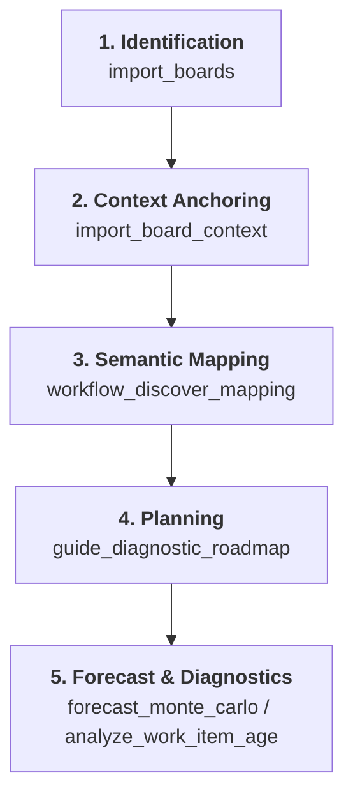

# MCS-MCP Architecture & Operational Manual

This document provides a comprehensive overview of the MCS-MCP (Monte-Carlo Simulation Model Context Protocol) server. It is designed to serve as both a high-level conceptual map and a technical reference for AI agents.

---

## 1. Operational Flow (The Interaction Model)

To achieve reliable forecasts, the interaction with MCS-MCP follows a specific analytical sequence.

1.  **Identification**: Use `import_projects`/`import_boards` to locate the target.
2.  **Context Anchoring**: `import_board_context` performs an **Eager Fetch** of history and stabilizes the project context via the **Data Shape Anchor**.
3.  **Semantic Mapping**: `workflow_discover_mapping` uses **Data Archeology** to propose logical process tiers (Demand, Upstream, Downstream, Finished). **AI agents must verify this mapping before proceeding.**
4.  **Planning**: `guide_diagnostic_roadmap` recommends a sequence of tools based on the user's goal (e.g., forecasting, bottleneck analysis).
5.  **Analytics**: High-fidelity diagnostics (Aging, Stability, Simulation) are performed against confirmed tiers.

---

## 2. Core analytical Principles: "Fact-Based Archeology"

MCS-MCP rejects reliance on often-misconfigured Jira metadata (like `statusCategory`). Instead, it infers process reality from objective transition logs.

### 2.1 The 4-Tier Meta-Workflow Model

Every status is mapped to a logical process layer to ensure specialized clock behavior:

| Tier           | Meaning                          | Clock Behavior                                        |
| :------------- | :------------------------------- | :---------------------------------------------------- |
| **Demand**     | Unrefined entry point (Backlog). | Clock pending.                                        |
| **Upstream**   | Analysis/Refinement.             | Active clock (Discovery).                             |
| **Downstream** | Actual Implementation (WIP).     | Active clock (Execution).                             |
| **Finished**   | Terminal exit point.             | **Clock Stops**. Duration becomes fixed "Cycle Time". |

### 2.2 Discovery Heuristics

- **Birth Status**: The earliest entry point identifies the system's primary source of demand.
- **Terminal Sinks**: Statuses with high entry-vs-exit ratios identify logical completion points even if Jira resolutions are missing.
- **Backbone Order**: The "Happy Path" is derived from the most frequent sequence of transitions (Market-Share confidence > 15%).
- **Unified Regex Stemming**: Automatically links paired statuses (e.g., "Ready for QA" and "In QA") via semantic cores.

---

## 3. Workflow Outcome Alignment (Throughput Integrity)

The server distinguishes **how** and **where** work exits the process to ensure throughput accurately reflects value-providing capacity.

### 3.1 Outcome Classification

Once an item reaches the **Finished** tier, it is classified into semantic outcomes:

- **Outcome: Delivered**: Items with a resolution or status outcome mapped as value-providing (e.g., "Fixed", "Done"). **Only these are used for Throughput and Simulation.**
- **Outcome: Abandoned**: Items mapped as waste (e.g., "Won't Do", "Discarded"). These are excluded from delivery metrics but vital for **Yield Analysis**.

### 3.2 Detection Methodology

- **Resolution Mapping (Primary)**: The system prioritizes the explicit Jira `resolution` field.
- **Status Mapping (Fallback)**: If resolution data is missing, it falls back to the status-level outcome mapping.
- **Gold Standard Benchmark**: This precedence is verified against industry benchmarks and must be maintained for statistical integrity.

### 3.3 Yield Analysis

The server calculates the "Yield Rate" by attributing abandonment to specific tiers:

- **Explicit Attribution**: Uses outcome suffixes (e.g., `abandoned_upstream`).
- **Heuristic Attribution**: Backtracks to the last active status if the outcome is generically `abandoned`.

---

## 4. High-Fidelity Simulation Engine

MCS-MCP uses a **Hybrid Simulation Model** that integrates historical capability with current reality.

### 4.1 Three Layers of Accuracy

1.  **Statistical Capability**: Builds a throughput distribution using **Delivered-Only** outcomes from a sliding window (default: 180 days).
2.  **Current Reality (WIP Analysis)**: Explicitly analyzes the stability and age of in-flight work.
3.  **Demand Expansion**: Automatically models the "Invisible Friction" of background work (Bugs, Admin) based on historical type distribution.
4.  **Stratified Coordinated Sampling**: Detects and isolates distinct delivery streams to model capacity clashes (Bug-Tax).

### 4.2 Stratified Coordinated Sampling (Advanced Modeling)

The engine can transition from a **Pooled** to a **Stratified** model if work item types show significantly different delivery profiles.

- **Dynamic Eligibility**: Stratification is only enabled if a type has sufficient volume (>15 items) and its Cycle Time variance is >15% from the pooled average. This isolates unstable or bursty processes without over-fitting to sparse data.
- **Capacity Coordination (Preventing the Capacity Fallacy)**: Independent strata are sampled concurrently butcoordinated by a **Daily Capacity Cap** (P95 of historical total throughput). This prevents the "stacking" of independent samples from generating unrealistic velocity that exceeds the team's theoretical limit.
- **The 'Bug-Tax' (Statistical Correlation)**: The engine automatically detects negative correlations between throughput strata. If "Type A" (the Taxer) has high volume on days where "Type B" (the Taxed) is low, the simulation mirrors this constraint, ensuring that an increase in Bugs correctly constrains Story delivery.
- **Bayesian Blending**: For types with sparse historical data, the engine "blends" stratified behavior with the pooled average (30% bias) to maintain statistical stability while honoring unique type attributes.
- **Modeling Transparency**: Every result includes a `modeling_insight` field that discloses if the simulation used a pooled or stratified approach and why.

### 4.3 Standardized Percentile Interpretation

To ensure consistency across simulations, aging, and persistence, the following standardized mapping is used:

| Naming           | Percentile | Meaning                                                 |
| :--------------- | :--------- | :------------------------------------------------------ |
| **Aggressive**   | P10        | Best-case outlier; "A miracle occurred."                |
| **Unlikely**     | P30        | Very optimistic; depends on everything going perfectly. |
| **Coin Toss**    | P50        | Median; 50/50 chance of being right or wrong.           |
| **Probable**     | P70        | Reasonable level of confidence; standard for planning.  |
| **Likely**       | P85        | High confidence; recommended for commitment.            |
| **Conservative** | P90        | Very cautious; accounts for significant friction.       |
| **Safe-bet**     | P95        | Extremely likely; includes heavy tail protection.       |
| **Limit**        | P98        | The practical upper bound of historical data.           |

### 4.4 Simulation Safeguards

To prevent nonsensical forecasts, the engine implements several integrity thresholds:

- **Throughput Collapse Barrier**: If the median simulation result exceeds 10 years, a `WARNING` is issued. This usually indicates that filters (`issue_types` or `resolutions`) have reduced the sample size so much that outliers dominate.
- **Resolution Density Check**: Monitors the ratio of "Delivered" items vs. "Dropped" items. If **Resolution Density < 20%**, a `CAUTION` flag is raised, warning that the throughput baseline may be unrepresentative.

### 4.5 Walk-Forward Analysis (Backtesting)

The system provides `forecast_backtest` to validate the reliability of Monte-Carlo simulations via historical backtesting.

- **Adaptive Validation Batching**: If not provided, the number of items to forecast is automatically set to **2x the median weekly throughput** of the last 10 weeks. This ensures the forecast horizon is always relevant to the team's actual velocity.
- **Overlapping Weekly Steps**: The analysis iterates backwards through history using a **7-day step size** (overlapping windows). This increases diagnostic sensitivity and allows for earlier detection of systemic process shifts.
- **Drift Protection**: Backtesting automatically terminates if a significant process shift is detected via the Three-Way Control Chart, preventing misleading accuracy results.
- **Midnight Alignment**: Analysis dates are truncated to midnight to eliminate "partial-day bias," ensuring that daily-bucketed simulations align with real-world outcomes.
- **Reconstruction Hardening**: The backtesting engine uses terminal status mappings during historical reconstruction to ensure finished items in the past are accurately projected.

---

## 5. Volatility & Predictability Metrics

The server provides statistical dispersion metrics to quantify process stability and risk.

### 5.1 Dispersion Metrics (The Spread)

- **IQR (Interquartile Range)**: P75 - P25. Measures the density of the middle 50%. Smaller = higher predictability.
- **Inner 80%**: P90 - P10. Shows the range where 80% of items fall, providing a robust view of the "middle" without extreme outlier noise.

### 5.2 Volatility Heuristics (The Risk)

| Metric                       | Stable Threshold | Indication of Failure                                                                                                    |
| :--------------------------- | :--------------- | :----------------------------------------------------------------------------------------------------------------------- |
| **Tail-to-Median (P85/P50)** | **<= 3.0**       | **Highly Volatile**: If > 3.0, high-confidence items take >3x the median, indicating heavy-tailed risk.                  |
| **Fat-Tail Ratio (P98/P50)** | **< 5.6**        | **Unstable**: Kanban University heuristic. If >= 5.6, extreme outliers control the process, making forecasts unreliable. |

---

## 6. Stability & Evolution (XmR)

Process Behavior Charts (XmR) assess whether the system is "in control."

- **XmR Individual Chart**: Detects outliers (points above Natural Process Limits) and shifts (8 consecutive points on one side).
- **Three-Way Tactical Audit**: Uses subgroup averages (weekly/monthly) to detect long-term strategic process drift.
- **WIP Age Monitoring**: Compares current WIP against historical limits to provide early warnings of a "Clogged" system.
- **Stability Guardrails (System Pressure)**: Automatically calculates the ratio of blocked (Flagged) items in the current WIP. If **Pressure >= 0.25 (25%)**, the system emits a `SYSTEM PRESSURE WARNING`, indicating that historical throughput is an unreliable proxy for the future due to high impediment stress.

---

## 7. Friction Mapping (Impediment Analysis)

MCS-MCP identifies systemic process friction by analyzing "Flagged" events and correlating them with workflow residency.

### 7.1 Methodology: Geometric Intersection

Instead of calculating a prone-to-misuse "Flow Efficiency" ratio, the system identifies absolute signals of impediment:

1.  **Interval Extraction**: The system extracts contiguous "Blocked" intervals from the event-sourced log (from `Flagged` to `Unflagged` or terminal status).
2.  **Status Segmentation**: The item's journey is divided into discrete status residency segments.
3.  **Geometric Intersection**: The system overlays blocked intervals onto status segments. If an item was flagged for 5 days while in "In Development", those 5 days are attributed to that status's `BlockedResidency`.

### 7.2 Impediment Signals

Friction is reported through absolute metrics rather than percentages:

- **Impediment Count (`BlockedCount`)**: The frequency of blocking events within a specific stage.
- **Impediment Depth (`BlockedP50/P85`)**: The typical duration an item remains blocked once an impediment occurs.

This approach provides a high-fidelity "Friction Heatmap" that pinpoint precisely where and for how long teams are held up, without the mathematical noise of efficiency ratios.

---

## 8. Internal Mechanics (The Event-Sourced Engine)

### 8.1 Staged Ingestion & Persistent Cache

- **Event-Sourced Architecture**: The system maintains an immutable, chronological log of atomic events (`Change`, `Created`, `Flagged`, `Unresolved`).
- **Two-Stage Hydration**:
    - **Stage 1 (Recent Updates)**: Fetches the last 1000 items sorted by `updated DESC`.
    - **Stage 2 (Baseline Depth)**: Explicitly fetches resolved items to ensure a minimum baseline (default 200 items).
- **Cache Integrity**:
    - **2-Month Rule**: If the latest cached event is > 2 months old, the system performs a full re-ingestion to clear potential "ghost" items (moved/deleted).
    - **24-Month Horizon**: Initial hydration is bounded to 24 months.
    - **8-Page Cap**: Ingestion is capped at 2400 items to prevent memory exhaustion in legacy projects.
    - **OMRC/NMRC Boundaries**: For targeted extensions, the system uses the Oldest/Newest Most-Recent-Change (OMRC/NMRC) boundary logic to prevent data gaps or overlaps.
    - **Purge-before-Merge**: Targeted extensions replace existing issue histories to ensure Jira deletions or corrections are reflected.
- **Cache Management Tools**:
    - `import_history_expand`: Fetches older items backwards from the **OMRC** boundary and catch-up forward from **NMRC**.
    - `import_history_update`: Syncs the cache with any updates made in Jira since the last **NMRC**.
- **Dynamic Discovery Cutoff**: Automatically calculates a "Warmup Period" (Dynamic Discovery Cutoff) to exclude noisy bootstrapping periods from analysis.

### 8.2 Analytical Orchestration (`AnalysisSession`)

To reduce boilerplate and ensure consistency across tools, the system utilizes a centralized **AnalysisSession** (Orchestrator).

- **Encapsulated Pipeline**: The session handles the entire hydration-to-projection pipeline (Context -> Events -> Items -> Filtered Samples).
- **Consolidated Projections**: All analytical projections (Scope, WIP, Throughput) are anchored to the session's temporal window, ensuring that different tools (e.g., Simulation and Aging) ALWAYS operate on the same data snapshot.
- **Windowed Context**: The session maintains the **AnalysisWindow**, providing a single point of truth for "Now" vs "Then" during historical reconstructions.

### 8.3 Strategic Decoupling (Package Boundaries)

The codebase follows a strict acyclic dependency model designed for stability during rapid refactoring:

- **`internal/eventlog`**: The agnostic storage layer. It knows how to transform and persist Jira events but has NO awareness of analytical metrics.
- **`internal/stats`**: The analytical engine. It depends on `eventlog` for data but contains all the business logic for metrics, residency, and projections.
- **`internal/jira`**: The DTO and Mapping layer. Houses the objective Jira domain models and transformation logic.
- **`internal/stats/discovery`**: A specialized sub-package for non-deterministic "Best Guess" workflow heuristics, keeping the core `stats` package focused on pure mathematics.

### 8.4 Discovery Sampling Rules

To ensures discovery reflect the **active process**, the system applies recency bias:

- **Priority Window**: Items created within the last **365 days** are prioritized.
- **Adaptive Fallback**: Expands to 2 or 3 years only if the priority window has < 100 items. Items older than 3 years are strictly excluded from discovery.

### 8.5 Backward Boundary Scanning (History Transformation)

To ensure analytical integrity when issues move between projects or change workflows, the system uses a **Backward Boundary Scanning** strategy during transformation:

- **Directionality**: Histories are processed **backwards** from the current state (Truth) towards the birth.
- **Boundary Detection**: The system identifies process boundaries by detecting a change in identity (`Key`) signifying entering the target project.
- **Arrival Anchoring**: The moment a boundary is hit, the scan terminates. The state transition at this boundary defines the item's **Arrival Status** in the target project.
- **Synthetic Birth**: While the Jira `Created` date (Biological Birth) is preserved, the issue is conceptually re-born into the target project at that arrival status. This ensures that its initial duration correctly reflects its time spent in the project's entry point.
- **Throughput Integrity**: The system ignores `Created` events for delivery dating. Throughput is only attributed to true `Change` events (resolutions or terminal status transitions), ensuring moved items are counted at their arrival/completion point rather than their biological birth.

### 8.6 Technical Precision

- **Microsecond Sequencing**: Changlogs are processed with integer microsecond precision for deterministic ordering.
- **Residency**: Residency tracking uses exact seconds (`int64`), converted to days only at the reporting boundary (`Days = seconds / 86400`).
- **Zero-Day Safeguard**: Current aging metrics are rounded up to the nearest 0.1 to avoid misleading "0.0 days" results.

---

## 9. Data Security & GRC Principles

MCS-MCP is designed with **Security-by-Design** and **Data Minimization** at its core.

### 9.1 Principle: Need-to-Know

The system strictly adheres to the "Need-to-Know" principle by ingests and persisting only the analytical metadata required for flow analysis.

- **Analytical Metadata (Fetched & Persisted)**: Issue Keys, **Issue Types**, Status Transitions, Timestamps, Resolution names, and **Flagged/Blocked history**.
- **Sensitive Content (DROPPED)**: While Jira may return full objects, the ingestion and transformation layer strictly **drops** fields such as **Summary (Title), Description, Acceptance Criteria, and Assignees** at the first processing step.
- **Impact**: This ensures that sensitive information is never exposed to the analytical models, never persisted to the cache, and never made available to the AI Agent.

### 9.2 Principle: Transparency (Auditability)

The system maintains absolute transparency in how data is stored and used.

- **Human-Readable Storage**: Long-term caches (Event Logs, Workflow Metadata) are stored in plain-text JSON/JSONL formats.
- **Auditability**: Security officers can at any time inspect the `cache` directory to verify that no sensitive data has been leaked during the ingestion process.
- **Fact-Based Archeology**: By deriving the workflow from transition logs rather than configuration metadata, the system ensures that the analytical view remains objective and untainted by human-entered (and potentially sensitive) configuration details.

---

## 10. Comprehensive Stratified Analytics

MCS-MCP implements **Type-Stratification** as a core architectural baseline across all diagnostics. This ensures that process insights are not diluted by a heterogeneous mix of work (e.g., mixing 2-day Bugs with 20-day Stories).

### 10.1 The Architecture of Consistency

Every analytical tool in the server has been extended to provide both pooled (system-wide) and stratified (type-specific) results:

| Tool                | Stratified Capability                                             | Rationale                                                               |
| :------------------ | :---------------------------------------------------------------- | :---------------------------------------------------------------------- |
| **Monte Carlo**     | Stratified Capacity / Bayesian Blending / correlations.           | Prevents "Invisibility" of slow items in mixed simulations.             |
| **Cycle Time SLEs** | Full Percentile sets per Work Item Type.                          | Sets realistic, data-driven expectations for different classes of work. |
| **WIP Aging**       | Type-Aware Staleness Detection (Percentile-based).                | Prevents false-negative "Clogged" alerts for complex/slow types.        |
| **Stability (XmR)** | Individual & Moving Range limits per Type.                        | Detects special cause variation that is masked in a pooled view.        |
| **Yield Analysis**  | Attribution of Delivery vs. Abandonment per Type.                 | Identifies which work types suffer the most process waste.              |
| **Throughput**      | Weekly/Monthly delivery cadence per Type with flexible bucketing. | Visualizes where teams actually spend their delivery "bandwidth".       |
| **Residency**       | Status-level residency percentiles (P50..P95) per Type.           | pinpoints type-specific bottlenecks at the status level.                |

### 10.2 Statistical Integrity Guards

To maintain reliability, stratification follows strict defensive heuristics:

- **Volume Thresholds**: Smaller cohorts are automatically blended with pooled averages using **Bayesian Weighting** to prevent outlier spikes from dominating the analysis.
- **Temporal Alignment**: All stratified time-series (XmR, Cadence) are aligned to the same analytical windows and bucket boundaries (Midnight UTC) to allow for across-tool correlation.
- **Conceptual Coherence**: By using the same work item types and outcome semantics across every tool, the system provides a unified "Process Signature" for the project.

---

## 11. Golden File Integration Testing (Mathematical Hardening)

To guarantee the absolute integrity of statistical and probabilistic projections during refactoring, MCS-MCP relies on an end-to-end **Golden File Integration Testing** framework.

### 11.1 The Adversarial Dataset

Rather than mocking isolated 2-issue scenarios, the test suite injects a massive `simulated_events.json` database into the analytical pipelines.

- **Real-World Origins**: Derived from an anonymized, high-volume production Jira log to ensure authentic process chaos.
- **Edge-Case Injection**: The timeline is deliberately spiked with mathematical anomalies (e.g., fractional-millisecond residency, cyclic status ping-ponging, and zero-throughput gaps) to stress-test division-by-zero guards and aging thresholds.

### 11.2 Deterministic Execution

To ensure byte-for-byte consistency across test runs, the system enforces strict determinism:

- **Simulation Seeding**: The Monte-Carlo Engine receives a fixed random seed (`SetSeed(42)`), disabling entropy so complex distributions can be byte-verified.
- **Temporal Anchoring**: Instead of relative `time.Now()` calculations, functions like `CalculateInventoryAge` accept an injected `evaluationTime`. The testing harness computes the exact maximum timestamp present in the anonymized dataset to serve as the definitive "Now".

### 11.3 Integration Baselines

The framework bypasses HTTP/JSON layers and tests the core mathematical engines directly:

- **Pipeline Snapshotting**: The `stats` pipeline and the `simulation` pipeline dump their entire analytical output (Cadence, YTM, XmR, percentiles) into massive JSON files (`testdata/golden/stats_pipeline_golden.json`, etc.).
- **Drift Detection**: Any code change that shifts a percentile or alters chronological sorting causes a byte-comparison failure against the golden files. If the shift is intentional, the developer must explicitly re-anchor the system via `go test -update` to register the new mathematical truth.
