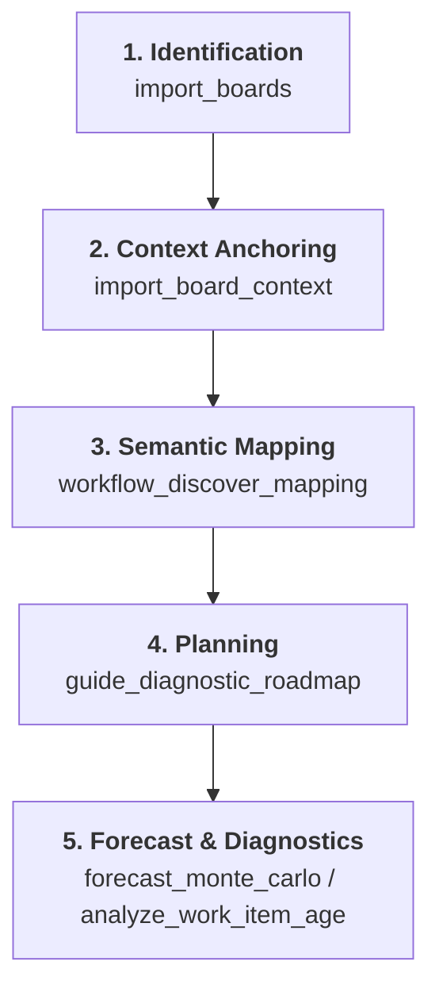
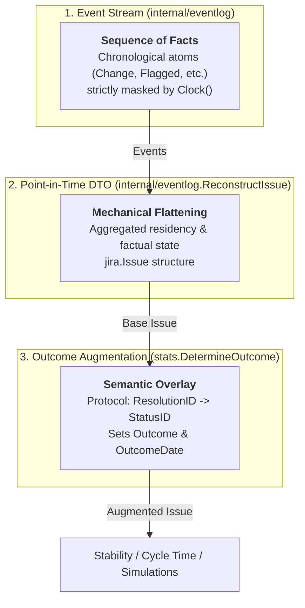

# MCS-MCP Architecture & Operational Manual

Conceptual map and technical reference for MCS-MCP (Monte-Carlo Simulation Model Context Protocol) server. Audience: AI agents.

---

## 1. Operational Flow (The Interaction Model)

Reliable forecasts require the following analytical sequence.


```mermaid
graph TD
    A["<b>1. Identification</b><br/>import_boards"] --> B["<b>2. Context Anchoring</b><br/>import_board_context"]
    B --> C["<b>3. Semantic Mapping</b><br/>workflow_discover_mapping"]
    C --> D["<b>4. Planning</b><br/>guide_diagnostic_roadmap"]
    D --> E["<b>5. Forecast & Diagnostics</b><br/>forecast_monte_carlo / analyze_work_item_age"]
```

1. **Identification**: Use `import_projects`/`import_boards` to locate the target.
2. **Context Anchoring**: `import_board_context` performs an **Eager Fetch** of history and stabilizes the project context via the **Data Shape Anchor**.
3. **Semantic Mapping**: `workflow_discover_mapping` uses **Data Archeology** to propose logical process tiers (Demand, Upstream, Downstream, Finished). **AI agents must verify this mapping before proceeding.**
4. **Planning**: `guide_diagnostic_roadmap` recommends a sequence of tools based on the user's goal (e.g., forecasting, bottleneck analysis).
5. **Analytics**: High-fidelity diagnostics (Aging, Stability, Simulation) are performed against confirmed tiers.

---

### 1.1 Tool Directory

All MCP tools, grouped by category.

#### Data Ingestion

| Tool | Purpose |
| :--- | :--- |
| `import_projects` | Search Jira projects by name or key. |
| `import_boards` | Find Agile boards for a project, with optional name filtering. |
| `import_project_context` | Fetch a Data Shape Anchor (volume and type distribution) for a project-level context. |
| `import_board_context` | Fetch a Data Shape Anchor for a specific board; triggers an Eager Hydration of event history. |
| `import_history_update` | Sync the cache with any Jira updates since the last NMRC. |

#### Workflow Configuration

| Tool | Purpose |
| :--- | :--- |
| `workflow_discover_mapping` | Probe status categories, residency times, and resolutions to propose a semantic workflow mapping (tiers, roles, outcomes). |
| `workflow_set_mapping` | Persist the user-confirmed semantic metadata (tier, role, outcome) for statuses and resolutions. Triggers Discovery Cutoff recalculation. |
| `workflow_set_order` | Define the chronological order of statuses for range-based analytics (CFD, Flow Debt). |
| `workflow_set_evaluation_date` | Inject a specific date for time-travel analysis. Set to empty to return to real-time mode. |
| `set_analysis_window` | Set the session-scoped `[start, end]` analysis window consumed by all diagnostics. Accepts `{start_date, end_date}`, `{end_date, duration_days}`, or `{reset: true}`. |
| `get_analysis_window` | Return the active session window and its `source` (`session` if set explicitly, `default` otherwise — default is rolling 26 weeks anchored at `Clock()`). |

#### Diagnostics

| Tool | Purpose |
| :--- | :--- |
| `analyze_status_persistence` | Identify bottlenecks by analyzing time items spend in each workflow status (P50/P85/P95). |
| `analyze_work_item_age` | Detect aging WIP outliers relative to P85 historical norms. Includes aggregate summary with P50/P85/P95 thresholds, risk-band distribution, and Little's Law stability index. |
| `analyze_throughput` | Analyze weekly delivery volume with XmR stability limits. |
| `analyze_process_stability` | Assess cycle-time predictability using XmR charts. Includes a Cycle Time Scatterplot array for visualization. |
| `analyze_flow_debt` | Analyze the balance between commitment arrivals and delivery departures. |
| `analyze_wip_stability` | Analyze WIP population stability via daily run chart with XmR bounds. |
| `analyze_wip_age_stability` | Analyze Total WIP Age stability (cumulative age burden) via daily run chart with XmR bounds. |
| `analyze_process_evolution` | Perform a longitudinal "Strategic Audit" using Three-Way Control Charts. |
| `analyze_yield` | Analyze delivery efficiency (delivered vs. abandoned) attributed to workflow tiers. |
| `analyze_cycle_time` | Calculate Service Level Expectations (SLE) from historical cycle times. Includes a Cycle Time Scatterplot array for visualization with SLE reference lines, plus a weekly **SLE Adherence Trend** (attainment rate + breach severity) against the auto-derived P85 or a user-supplied fixed SLE. |
| `analyze_item_journey` | Get a detailed breakdown of a single item's time across all workflow stages. |
| `analyze_residence_time` | Perform Sample Path Analysis (finite Little's Law) — compute L(T) = Λ(T) · w(T) to unify cycle time, WIP age, and flow debt into a single coherent view. Includes w'(T) (departure-denominated residence time) and Θ(T) (departure rate) to detect flow imbalance when Λ(T) ≠ Θ(T). |
| `generate_cfd_data` | Calculate daily population counts per status and issue type for CFD visualization. |

> **Sample Path Population Rule**: `analyze_residence_time` only includes items whose transition history shows at least one crossing of the commitment boundary (status below commitment weight → at-or-above). Items without commitment evidence have zero residence time and are excluded — the server does not fabricate commitment dates. Consequence: D(T) may be lower than throughput from `analyze_throughput`, which counts all `Outcome == "delivered"` items regardless of transition evidence. By design: including zero-residence-time items would inject artificial near-zero sojourn times that distort w(T), W*(T), and the coherence gap.

#### Forecasting

| Tool | Purpose |
| :--- | :--- |
| `forecast_monte_carlo` | Run a Monte-Carlo simulation to forecast a delivery date or volume. |
| `forecast_backtest` | Perform Walk-Forward Analysis (backtesting) to empirically validate forecast accuracy. |

#### Navigation

| Tool | Purpose |
| :--- | :--- |
| `guide_diagnostic_roadmap` | Return a recommended, goal-driven sequence of tools (forecasting, bottlenecks, capacity planning, system health). Returns static guidance; does not examine live data. |

---

## 2. Core analytical Principles: "Fact-Based Archeology"

Jira metadata (`statusCategory` etc.) is often misconfigured. MCS-MCP infers process reality from objective transition logs instead.

### 2.1 The 4-Tier Meta-Workflow Model

Every status is mapped to a logical process layer for specialized clock behavior:

| Tier           | Meaning                          | Clock Behavior                                        |
| :------------- | :------------------------------- | :---------------------------------------------------- |
| **Demand**     | Unrefined entry point (Backlog). | Clock pending.                                        |
| **Upstream**   | Analysis/Refinement.             | Active clock (Discovery).                             |
| **Downstream** | Actual Implementation (WIP).     | Active clock (Execution).                             |
| **Finished**   | Terminal exit point.             | **Clock Stops**. Duration becomes fixed "Cycle Time". |

### 2.1.1 Work In Progress (WIP) Definition

An item is **WIP** once it crosses the **Commitment Point**. WIP = all statuses with workflow weight ≥ commitment point weight, up to (excluding) the **Finished** tier. The commitment point is freely configurable and may sit anywhere — including inside Upstream, between Upstream and Downstream, or inside Downstream. WIP is therefore not synonymous with "Downstream"; when the commitment point sits inside Upstream, upstream statuses at or past it also contribute to WIP time.

`cumulative_wip_days` (inventory aging) reflects this: residency from the commitment point onward, excluding Finished.

### 2.1.2 Backflow & Clock Reset Behavior

**Backflow**: item transitions to a status whose weight is below the **commitment point** weight — moves backwards past the committed boundary. Detected purely by weight comparison against the commitment point (not tier membership), because the commitment point may sit anywhere (including mid-Downstream).

When backflow past the commitment point is detected:

| Metric             | Effect                                                                                                              |
| :----------------- | :------------------------------------------------------------------------------------------------------------------ |
| **Cycle Time**     | Clock resets. Transitions before the last backflow are trimmed; residency recalculated from that point forward.     |
| **WIP Age**        | Clock resets (same policy as Cycle Time). Controlled by `COMMITMENT_POINT_BACKFLOW_RESET_CLOCK` (default: `true`).  |
| **WIP Run Chart**  | Item exits WIP on backflow (same as crossing the delivery point) and re-enters on recommitment.                     |
| **Status Age**     | Unaffected (always measures time in current status only).                                                           |

> **Design Note**: future enhancement will make the delivery point similarly configurable — both "clock start" and "clock stop" freely positionable.

### 2.2 Discovery Heuristics

- **Birth Status**: earliest entry point = primary source of demand.
- **Terminal Sinks**: statuses with high entry-vs-exit ratios = logical completion points even when Jira resolutions are missing.
- **Backbone Order**: "Happy Path" derived from most frequent transition sequence (Market-Share confidence > 15%).
- **Unified Regex Stemming**: links paired statuses (e.g. "Ready for QA" / "In QA") via semantic cores.

### 2.3 Session Analysis Window

One in-memory `[start, end]` range scopes every diagnostic. One setter (`set_analysis_window`), one reader (`get_analysis_window`), and `Server.Window()` returning either the explicit session range or lazy default `[Clock()-26 weeks, Clock()]`.

**Why one window for all diagnostics?** Cross-tool coherence in multi-step sessions (e.g. "analyze the last quarter") previously required passing `history_window_*` per tool. Per-tool window params were removed; every diagnostic reads `s.Window()` directly. Set once, shift with one call.

**Resolution rule per handler.**

- **Range-consuming tools** (`analyze_throughput`, `analyze_wip_stability`, `analyze_wip_age_stability`, `analyze_flow_debt`, `generate_cfd_data`, `analyze_process_stability`, `analyze_residence_time`, `analyze_status_persistence`, `analyze_cycle_time`, `analyze_yield`): pass `Window().Start` and `Window().End` to `stats.NewAnalysisWindow`.
- **`analyze_work_item_age`**: point-in-time. Uses **only** `Window().End` as snapshot date. Start ignored — items aren't "in-flight" over a range.
- **`analyze_process_evolution`**: long-term trend. Uses **only** `Window().End` as right edge, looks back a fixed horizon (12 complete months for `bucket=month`, 26 complete weeks for `bucket=week`) via `stats.LastCompleteBucketEnd`. Start ignored — short ranges defeat trend detection. Partial trailing buckets excluded.
- **Forecasting** (`forecast_monte_carlo`, `forecast_backtest`): exempt. Sample windows auto-sized by the simulation engine (§4); forcing the diagnostic window would override adaptive logic. Forecast tools keep their own `history_window_days` / `history_start_date` / `history_end_date` overrides.

**Lifecycle.** In-memory only — never persisted, never copied into `WorkflowMetadata`. Resets on board switch (alongside `activeEvaluationDate`) and on server restart. Board switch always starts from lazy default; setting evaluation date does not move the window. Preserves "window = exploration; eval date = reproducibility anchor."

**Footer in every response.** `handleResult` injects `session_window` (`{start, end, duration_days, source}`) into every tool response's `context`, so the agent sees which window shaped the output.

**Clamping.** `stats.NewAnalysisWindow` clamps `Start` against `activeDiscoveryCutoff` to exclude pre-steady-state events. Session window is the *requested* range; clamping happens inside the helper.

---

## 3. Workflow Outcome Alignment (Throughput Integrity)

Server distinguishes **how**, **when**, **where** work exits — ensures throughput reflects value-providing capacity and cycle times are deterministic.

### 3.1 The 2-Step Outcome Protocol (ID-First)

Jira's raw state is too chaotic for direct analytical use. The core `jira.Issue` struct is augmented with `Outcome` (`"delivered"` or `"abandoned"`) and `OutcomeDate` during historical reconstruction.

Performed by `stats.DetermineOutcome`, strict **ID-First**:

1. **Primary (Explicit ResolutionID):** check Jira `ResolutionID` against `activeResolutions`. If found, `OutcomeDate` = `ResolutionDate`. If `ResolutionID` not in map, fall back to resolution *name* lookup (`issue.Resolution`); if still unmapped, default `"delivered"` with warning log.
2. **Fallback (Workflow Mapping):** if no `ResolutionID`, check whether the current `StatusID` belongs to `"Finished"` tier. If true, use the Outcome mapped to that Status. `OutcomeDate` synthesized by walking back through transitions to the start of the current uninterrupted Finished-tier streak — first moment the item entered terminal state.

### 3.2 Downstream Isolation (The "Outcome" Guardrail)

**All downstream analytical functions are decoupled from raw Jira metadata.**

Throughput, Flow Cadence, Cycle-Time, Monte-Carlo, Stability (XmR) **must solely use** `issue.Outcome` and `issue.OutcomeDate`. They never check `ResolutionDate`, `StatusCategory`, or `Tier`.

- **Throughput & Simulation**: aggregate only `issue.Outcome == "delivered"`. `"abandoned"` items (e.g. "Won't Do", "Discarded") excluded from capacity forecasting; still used by Yield Analysis.
- **Cycle Time**: chronological subtraction against `issue.OutcomeDate`, so items moving silently into "Done" still get accurate terminal dates.

### 3.3 Yield Analysis Attribution

Yield Rate attributes abandonment to specific tiers:

- **Heuristic Attribution**: backtrack through `Transitions` to the last active status when outcome is `abandoned`.

### 3.4 Workflow Discovery Response Format

`workflow_discover_mapping` content depends on whether a confirmed mapping exists on disk:

- **`NEWLY_PROPOSED`**: no confirmed mapping found (or `force_refresh` requested). Response includes `workflow.proposed_resolutions` — every resolution name in the sample mapped to inferred outcome (`"delivered"` or `"abandoned"`). The AI **must** present this for user confirmation before calling `workflow_set_mapping`.
- **`LOADED_FROM_CACHE`**: previously user-confirmed mapping exists on disk with non-empty status mapping. Cached tiers, order, commitment point, and resolution mapping returned as-is. `workflow.proposed_resolutions` **omitted**; AI reconfirms with user.

`discovery_source` (in `diagnostics` envelope) carries this value. `_metadata.is_cached` mirrors it.

**Default Resolution Fallbacks (`getResolutionMap`):** when no confirmed mapping exists, discovery seeds with these name-keyed defaults:

| Resolution Name | Default Outcome |
| :--- | :--- |
| Fixed, Done, Complete, Resolved, Approved | `delivered` |
| Closed, Won't Do, Discarded, Obsolete, Duplicate, Cannot Reproduce, Declined | `abandoned` |

---

## 4. High-Fidelity Simulation Engine

**Hybrid Simulation Model** — integrates historical capability with current reality.

### 4.1 Three Layers of Accuracy

1. **Statistical Capability**: throughput distribution from **Delivered-Only** outcomes over a sliding window (default 90 days).
2. **Current Reality (WIP Analysis)**: stability and age of in-flight work.
3. **Demand Expansion**: models "Invisible Friction" of background work (Bugs, Admin) from historical type distribution.
4. **Stratified Coordinated Sampling**: isolates distinct delivery streams to model capacity clashes (Bug-Tax).

### 4.2 Stratified Coordinated Sampling (Advanced Modeling)

Engine switches from **Pooled** to **Stratified** when work item types show significantly different delivery profiles.

- **Dynamic Eligibility**: stratification only when a type has sufficient volume (>15 items) and Cycle Time variance >15% from pooled average. Isolates unstable/bursty processes without over-fitting sparse data.
- **Capacity Coordination (Preventing the Capacity Fallacy)**: independent strata sampled concurrently but coordinated by a **Daily Capacity Cap** (P95 of historical total throughput). Prevents stacked samples from exceeding the team's theoretical limit.
- **The 'Bug-Tax' (Statistical Correlation)**: engine detects negative correlations between throughput strata. If Type A (Taxer) has high volume on days where Type B (Taxed) is low, simulation mirrors this constraint — increased Bugs correctly constrains Story delivery.
- **Bayesian Blending**: types with sparse history blend stratified behavior with pooled average (30% bias) for statistical stability.
- **Modeling Transparency**: every result includes `modeling_insight` disclosing pooled vs stratified and why.

### 4.3 Standardized Percentile Interpretation

Standardized mapping across simulations, aging, persistence:

| Naming           | Percentile | Meaning                                                 |
| :--------------- | :--------- | :------------------------------------------------------ |
| **Aggressive**   | P10        | Best-case outlier; "A miracle occurred."                |
| **Unlikely**     | P30        | Very optimistic; depends on everything going perfectly. |
| **Coin Toss**    | P50        | Median; 50/50 chance of being right or wrong.           |
| **Probable**     | P70        | Reasonable level of confidence; standard for planning.  |
| **Likely**       | P85        | High confidence; recommended for commitment.            |
| **Conservative** | P90        | Very cautious; accounts for significant friction.       |
| **Safe-bet**     | P95        | Extremely likely; includes heavy tail protection.       |
| **Limit**        | P98        | The practical upper bound of historical data.           |

### 4.4 Simulation Safeguards

Integrity thresholds preventing nonsensical forecasts:

- **Throughput Collapse Barrier**: median simulation result > 10 years → `WARNING`. Usually means filters (`issue_types` or `resolutions`) shrank the sample so much that outliers dominate.
- **Resolution Density Check**: ratio of Delivered vs Dropped items. **Density < 20%** → `CAUTION`: throughput baseline may be unrepresentative.
- **Unforecastable Type Exclusion**: target types with zero delivery history excluded from duration simulations. `CAUTION` guardrail names excluded types and count.
- **Stationarity Guardrail**: before each simulation, lightweight residence time analysis over the sampling window. `StationarityAssessment` inspects three signals:
  - **Diverging process** (`convergence == "diverging"`): average item age increasing → WIP accumulation. MCS uniform sampling assumption may be optimistic.
  - **Flow imbalance** (`Λ/Θ > 1.3`): arrival rate exceeds departure rate by 30%+. WIP growing; future throughput may be lower than historical samples.
  - **Aging WIP** (`|CoherenceGap|/W* > 0.5`): active items aging significantly beyond completed items → harder/stalled items remain.
  When non-stationarity is detected, a window recommendation is emitted as an insight (narrow sampling window to period after the detected inflection point). `stationarity_assessment` is included in simulation result's `context`.

### 4.5 Walk-Forward Analysis (Backtesting)

`forecast_backtest` validates Monte-Carlo reliability via historical backtesting.

- **Adaptive Validation Batching**: if not provided, items-to-forecast = **2× median weekly throughput** of last 10 weeks. Keeps forecast horizon relevant to actual velocity.
- **Fixed Step Count**: **25 checkpoints** by default (7-day step, 175-day lookback). Statistically meaningful regardless of range. Override lookback via `history_window_days` or `history_start_date`.
- **Aligned Sampling Windows**: each checkpoint builds its capability histogram from the **90 days ending at that checkpoint** — same default as single-run MCS. Backtest and live forecasting use consistent assumptions.
- **Full-History Event Loading**: events loaded from `max(globalCutoff, earliest_checkpoint − 90 days)` so even the oldest checkpoint has backing data.
- **Drift Protection**: backtest terminates automatically if a significant process shift is detected via the Three-Way Control Chart.
- **Midnight Alignment**: analysis dates truncated to midnight to eliminate partial-day bias; daily-bucketed simulations align with real-world outcomes.
- **Reconstruction Hardening**: backtesting uses terminal status mappings during historical reconstruction so past finished items project accurately.
- **Stationarity Correlation**: each checkpoint records a stationarity assessment. After all checkpoints, `StationarityCorrelation` compares miss rates between stationary and non-stationary checkpoints. If non-stationary miss rate > 2× stationary, signal is labeled `"predictive"` — empirically validates the stationarity guardrail for that project.

### 4.6 Multi-Engine Framework (Empirical Engine Selection)

No single Monte Carlo algorithm wins universally. MCS-MCP supports **multiple simulation engines** behind a common interface and selects empirically via walk-forward backtest.

#### Architecture

Every engine implements `ForecastEngine`:

- **`Name() string`** — unique id (e.g. `"crude"`, `"bbak"`).
- **`Run(req ForecastRequest) (Result, error)`** — full pipeline from raw issues to `simulation.Result`. Each engine owns the flow: histogram construction, optional pre-processing, Monte Carlo trials, result assembly.

Engines registered at startup in a `Registry`. Active engine selected via `MCS_ENGINE` env var.

#### Engine Selection Modes

| `MCS_ENGINE` value | Behavior |
| :--- | :--- |
| `crude` (default) | Uses the Crude engine directly. |
| `bbak` | Uses the Bbak engine (regime-aware sampling) directly. |
| `auto` | Runs all enabled engines in a single walk-forward backtest pass, then uses the engine with the highest accuracy score for the actual forecast. Ties are broken by engine weight. |

#### Per-Engine Weights

Each engine has `MCS_ENGINE_<NAME>` (integer 0–100):

- **0**: disabled (excluded from `auto` mode).
- **1–100**: enabled. In `auto` mode, weight is the tiebreaker when two engines achieve identical backtest accuracy — higher weight wins.

Example: `MCS_ENGINE_CRUDE=50`, `MCS_ENGINE_BBAK=50`.

#### Auto Mode Internals

When `MCS_ENGINE=auto`:

1. Handler gathers context (issues, window, targets).
2. One walk-forward backtest loop runs all enabled engines at each checkpoint → per-engine accuracy scores under identical conditions.
3. Highest hit rate wins. Tie → higher `MCS_ENGINE_<NAME>` weight wins.
4. Selected engine runs the actual forecast.
5. Response is **identical** to a single-engine forecast. Selected engine name stored in `Result.Context["auto_selected_engine"]` for logging only — not surfaced in insights or warnings.

### 4.7 Engine: Crude (Baseline)

Original algorithm; default; baseline for comparison.

**Algorithm:**

1. Throughput histogram from all delivered items within a fixed sampling window (default 90 days).
2. Monte Carlo engine from histogram.
3. Run N trials (1,000 duration, 10,000 scope), each sampling random days from histogram with replacement.
4. Percentile-based forecasts from trial distribution.

**Characteristics:**

- Full, unfiltered delivered set in window.
- Fixed sampling window (override via `history_window_days` or date range params).
- No outlier filtering, no adaptive windowing, no post-histogram resampling.
- Robust and predictable; performs well when process is stationary.

**Excels at:** stable teams with consistent throughput, no significant regime changes in window.

**Struggles with:** non-stationary processes, regime shifts in window, heavy histogram-skewing outliers.

### 4.8 Engine: Bbak (Regime-Aware Sampling)

Enhances baseline with a 5-step pre/post-processing pipeline (SPA pipeline) that adapts sampling window and histogram to current process regime.

**Algorithm:**

1. **Convergence Gate**: classify process as converging, diverging, or metastable via residence time (λ_implied vs λ_observed). If diverging, compute a scale factor for post-histogram throughput.
2. **Regime Boundary Detection**: identify regime transitions via first-difference sign reversals of Λ(T) and W(T), smoothed over min 14 buckets.
3. **Outlier Filtering**: sojourn times + Tukey IQR fence (Q3 + 1.5 × IQR). Outliers removed only if filtering improves convergence assessment — prevents unnecessary data loss.
4. **Adaptive Window**: walk back through departures (not calendar days) until min 50 non-outlier items accumulated. If walk crosses a non-stationary regime boundary, extend to next clean boundary. Hard ceiling: 365 days.
5. **Post-Histogram Resampling**: combined WIP/aging scale factor (λ_implied / histogram mean throughput × divergence factor). Clamped to [0.5, 2.0], snapped to 1.0 within ±0.05.

After pre-processing, same Monte Carlo trial engine as Crude runs on refined histogram.

**Characteristics:**

- Departure-count-based adaptive window (not fixed calendar).
- Outlier-aware: removes extreme sojourn times only when convergence improves.
- Regime-aware: respects process boundaries, avoids mixing regimes.
- Post-histogram resampling adjusts for WIP aging and divergence.
- Requires configured commitment point and workflow mapping for residence time. Falls back to Crude if prerequisites missing.

**Excels at:** teams with evolving processes, regime shifts, significant WIP aging — where fixed-window includes stale data.

**Struggles with:** very stable teams where adaptive machinery adds no value (no harm — converges to Crude-like results).

**Diagnostics:** SPA pipeline diagnostics (adaptive window bounds, outlier count, convergence status, scale factors) attached to `Result.Context["spa_pipeline"]` when Bbak is active.

---

## 5. Volatility & Predictability Metrics

Statistical dispersion metrics quantify process stability and risk.

### 5.1 Dispersion Metrics (The Spread)

- **IQR (Interquartile Range)**: P75 − P25. Density of middle 50%. Smaller = higher predictability.
- **Inner 80%**: P90 − P10. Robust "middle" range without extreme outlier noise.

### 5.2 Volatility Heuristics (The Risk)

| Metric                       | Stable Threshold | Indication of Failure                                                                                                    |
| :--------------------------- | :--------------- | :----------------------------------------------------------------------------------------------------------------------- |
| **Tail-to-Median (P85/P50)** | **<= 3.0**       | **Highly Volatile**: If > 3.0, high-confidence items take >3x the median, indicating heavy-tailed risk.                  |
| **Fat-Tail Ratio (P98/P50)** | **< 5.6**        | **Unstable**: Kanban University heuristic. If >= 5.6, extreme outliers control the process, making forecasts unreliable. |

---

## 6. Stability & Evolution (XmR)

XmR (Process Behavior Charts) assess whether the system is "in control."

- **XmR Individual Chart**: detects outliers (points above Natural Process Limits) and shifts (8 consecutive points on one side).
- **Three-Way Tactical Audit**: subgroup averages (weekly/monthly) detect long-term strategic drift.
- **WIP Age Monitoring**: compares current WIP against historical limits — early warning for a "Clogged" system.
- **WIP Stability Bounding**: daily WIP run charts bounded by weekly sampled XmR limits — detects Little's Law violations without daily autocorrelation skew.
- **Throughput Cadence (XmR)**: XmR limits on weekly/monthly delivery volumes — detects batching or "Special Cause" surges/dips.
- **Flow Debt (Arrival vs. Departure)**: gap between items crossing the **Commitment Point** (Arrivals) and items **Delivered** (Departures). Positive Flow Debt is a leading indicator of WIP inflation and cycle time degradation.
- **Stability Guardrails (System Pressure)**: ratio of blocked (Flagged) items in current WIP. **Pressure >= 0.25 (25%)** → `SYSTEM PRESSURE WARNING`: historical throughput unreliable due to impediment stress.
- **Cycle Time Scatterplot**: Process Stability and Cycle Time Analysis responses include a chart-ready `scatterplot` (per-item completion date, cycle time, pooled moving range, issue type). Process Stability uses XmR reference lines (X̄, UNPL, LNPL); Cycle Time Analysis uses SLE percentile reference lines (P50, P70, P85, P95).
- **SLE Adherence Trending**: `analyze_cycle_time` returns `sle_adherence` — weekly attainment-rate and breach-severity (max cycle time + P95 of breach excess) against a Service Level Expectation. Default SLE = rolling-window P85; override via `sle_percentile` or `sle_duration_days` for a fixed Vacanti-style baseline. Auto-derived SLE → handler emits Insight nudging the agent to ask user for the stated SLE so subsequent calls pin a stable threshold. Buckets carry `is_partial` so charts can fade the in-progress current week.

### 6.1 SLE Adherence Trending — Implementation Reference

**Home tool**: `analyze_cycle_time` (handler `internal/mcp/handlers_forecasting.go`, `handleGetCycleTimeAssessment`). SLE Adherence lives next to SLE derivation — `analyze_process_stability` stays XmR-focused. Vacanti's pairing of adherence with stability is a cross-tool *insight*, not a merged panel.

**Vacanti semantics** (see `docs/ideas.md` for open follow-ups):

- SLE has two parts: duration **and** probability. "85% of items in 14 days or less." Duration alone strips the probabilistic nature.
- **Attainment rate** = share of completed items finishing within SLE duration per bucket. For a P85 SLE, *expected* rate = 85% (not 15% — easy to invert; guard it).
- **Breach severity** = tail behaviour. Max cycle time + P95 of breach excess per bucket. An item past both P85 and P95 is qualitatively different from one barely over P85.

**Data pipeline**:

1. Handler builds rolling-window `AnalysisWindow` ("day" bucket) via `stats.NewAnalysisWindow(start, end, "day", cutoff)`. Adherence helper builds a *week-bucketed* companion with same boundaries.
2. `s.getCycleTimes(...)` returns aligned `matchedIssues []jira.Issue` + `cycleTimes []float64`.
3. `s.computeSLEAdherence(matchedIssues, cycleTimes, pcts, slePercentile, sleDurationDays, dayWindow)` resolves threshold via `percentileFromResult(pcts, p)` when `slePercentile > 0`, else defaults to `pcts.Likely` (P85). Source tag: `"user"` / `"derived_p85"` / `"derived_pXX"`.
4. `stats.ComputeSLEAdherence(...)` bucketises delivered items by `OutcomeDate` (falling back to `ResolutionDate`) using `AnalysisWindow.FindBucketIndex` and emits per-bucket attainment, max CT, P95 of breach excess. Partial buckets get `is_partial: true`.

**Gotchas**:

- `NewAnalysisWindow(start, start.AddDate(0,0,7), "week", …)` extends `end` to next Sunday → *two* weekly buckets. Build test windows with `start.AddDate(0,0,7*weeks-1)` so only intended N weeks land.
- `ExpectedRate = percentile/100`, never `1 - percentile/100`. Golden baseline catches inversion.
- Computation uses `matchedIssues` aligned by index with `cycleTimes`. Never re-sort one without the other; `stats.ComputeSLEAdherence` assumes pairwise correspondence.

**Chart layout** (`internal/charts/assets/templates/cycle_time.jsx`):

Panel order = reader's flow, not computation order: Stat Cards → Predictability & Spread → Scatterplot (primary visual) → Pool SLE → Per-type SLE → **SLE Attainment Trend** (Panel 5) → **Breach Severity** (Panel 6). Both trend panels gated on `d.sle_adherence`; partial buckets faded at 45% opacity so the current incomplete week isn't read as regression.

**AI nudge pattern**: auto-derived SLE → Insight instructs agent to ask user for the stated SLE and re-run with `sle_duration_days=<d>` (+ optional `sle_percentile=<n>`). User-supplied values flip `sle_source` to `"user"` and suppress the nudge. Same Insights-channel pattern as commitment point discovery (`handlers_forecasting.go:addCommitmentInsights`).

**Open follow-ups** (tracked in `docs/ideas.md`, not implemented):

- Stationarity-driven SLE invalidation (warn when CT distribution shift makes historical SLE stale). Would emit Insight from `analyze_process_stability` → `analyze_cycle_time`.
- Per-issue-type adherence trend. `TypeSLEs` already exists; adding per-type buckets multiplies chart real estate — deferred.
- Adaptive weekly→monthly cadence fallback when throughput too sparse for weekly buckets.

---

## 7. Friction Mapping (Impediment Analysis)

Identifies systemic friction via "Flagged" events correlated with workflow residency.

### 7.1 Methodology: Geometric Intersection

Avoids the prone-to-misuse "Flow Efficiency" ratio; uses absolute impediment signals:

1. **Interval Extraction**: contiguous "Blocked" intervals from event-sourced log (`Flagged` → `Unflagged` or terminal).
2. **Status Segmentation**: journey split into discrete status residency segments.
3. **Geometric Intersection**: blocked intervals overlaid on status segments. Item flagged for 5 days while "In Development" → 5 days attributed to that status's `BlockedResidency`.

### 7.2 Impediment Signals

Absolute metrics, not percentages:

- **Impediment Count (`BlockedCount`)**: frequency of blocking events per stage.
- **Impediment Depth (`BlockedP50/P85`)**: typical block duration once an impediment occurs.

Result: high-fidelity "Friction Heatmap" pinpointing where and how long teams are held up, no efficiency-ratio noise.

---

## 8. Internal Mechanics (The Event-Sourced Engine)

### 8.1 Single-Pass Ingestion & Persistent Cache

- **Event-Sourced Architecture**: immutable chronological log of atomic events (`Change`, `Created`, `Flagged`, `Unresolved`).
- **Single-Pass Hydration**: initial hydration runs one JQL sweep capturing both recently-touched items and long-lived items born in the window:

  ```text
  (<base jql>) AND (updated >= startOfDay(-{INGESTION_UPDATED_LOOKBACK}M)
                     OR created >= startOfDay(-{INGESTION_CREATED_LOOKBACK}M))
  ORDER BY updated DESC
  ```

  Paging stops at `INGESTION_MAX_ITEMS`. Wide `OR` makes a separate "resolved-baseline" sweep unnecessary — long-lived deliveries fall into the `created >= …` branch even if untouched recently.

- **Configuration** (`.env`):
  - `INGESTION_UPDATED_LOOKBACK` — months for `updated >=` (default `24`).
  - `INGESTION_CREATED_LOOKBACK` — months for `created >=` (default `36`).
  - `INGESTION_MAX_ITEMS` — page-cap on initial hydration (default `5000`). Forward catch-up not capped.

- **Cache Integrity**:
  - **2-Month Rule**: latest cached event > 2 months old → full re-ingestion clears potential "ghost" items (moved/deleted).
  - **NMRC Boundary**: forward catch-up uses Newest Most-Recent-Change timestamp from cache to fetch only updates since last sync.
  - **Purge-before-Merge**: catch-up replaces existing issue histories so Jira deletions/corrections are reflected.
  - **Atomic File Writes**: workflow metadata files written via temp-file + rename — no data loss from crashes mid-write.

- **Cache Management Tools**:
  - `import_board_context`: initial hydration (or cached load + 2-month-rule check).
  - `import_history_update`: syncs cache with Jira updates since last **NMRC**.

- **WorkflowMetadata Persistence**: each board's confirmed config persisted to `{cacheDir}/{projectKey}_{boardID}_workflow.json`. Stores status mapping (ID → Tier/Role/Outcome), resolution mapping (ID → outcome), status order, commitment point, discovery cutoff, evaluation date, `NameRegistry`. A file qualifies as "loaded from cache" (`isCachedMapping = true`) **only** when status mapping is non-empty — background-hydration saves before user confirmation don't qualify.

- **Dynamic Discovery Cutoff**: auto-computed "Warmup Period" excludes noisy bootstrap from analysis. Cutoff = **date of 5th delivery** after workflow mapping is confirmed, ensuring steady-state capacity before analytical windows open. Recalculated whenever `workflow_set_mapping` runs.

### 8.2 The Unified Outcome Protocol

Streamlined pipeline rebuilds work-item state with strict separation of concerns.


```mermaid
graph TD
    subgraph "1. Event Stream (internal/eventlog)"
        L1["<b>Sequence of Facts</b><br/>Chronological atoms (Change, Flagged, etc.)<br/>strictly masked by Clock()"]
    end
    subgraph "2. Point-in-Time DTO (internal/eventlog.ReconstructIssue)"
        L2["<b>Mechanical Flattening</b><br/>Aggregated residency & factual state<br/>jira.Issue structure"]
    end
    subgraph "3. Outcome Augmentation (stats.DetermineOutcome)"
        L3["<b>Semantic Overlay</b><br/>Protocol: ResolutionID -> StatusID<br/>Sets Outcome & OutcomeDate"]
    end
    L1 -->|Events| L2
    L2 -->|Base Issue| L3
    L3 -->|Augmented Issue| Analytics[Stability / Cycle Time / Simulations]
```

1. **Event Stream**: chronological extraction of atomic facts. Strictly masked by app-wide `Clock()` → 100% deterministic time-travel.
2. **Mechanical Flattening**: aggregates events into `jira.Issue` DTO. Computes raw status residency; ignores workflow meaning.
3. **Outcome Augmentation**: "Smart" layer. Applies confirmed project config (Mappings, Resolutions) to determine **how** and **when** the item reached terminal state. Decouples downstream (Cadence, Monte-Carlo) from inconsistent raw Jira metadata.

### 8.3 Analytical Orchestration (`AnalysisSession`)

Centralized **AnalysisSession** (Orchestrator) reduces boilerplate, ensures consistency.

- **Encapsulated Pipeline**: handles full hydration-to-projection (Context → Events → Items → Filtered Samples).
- **Consolidated Projections**: Scope, WIP, Throughput anchored to session's temporal window — Simulation and Aging always see the same snapshot.
- **Windowed Context**: session holds the **AnalysisWindow** — single source of truth for "Now" vs "Then" during reconstruction.

### 8.4 Strategic Decoupling (Package Boundaries)

Strict acyclic dependency model:

- **`internal/eventlog`**: agnostic storage. Transforms and persists Jira events; no analytical-metric awareness.
- **`internal/stats`**: analytical engine. Depends on `eventlog`; owns metrics, residency, projections.
- **`internal/jira`**: DTO and Mapping layer. Objective Jira domain models and transformation.
- **`internal/discovery`**: top-level package for non-deterministic "Best Guess" workflow heuristics. Fuses `eventlog` + `jira` + `stats` to infer semantic mapping. Promoted from `internal/stats/discovery` because it's a distinct concern that consumes stats, not a stats subset.

### 8.5 Discovery Sampling

Active discovery path: **`ProjectNeutralSample`** (recency-biased) — issues sorted by latest event timestamp desc, top N selected. Reflects the **active process**, not oldest history.

Companion utility `SelectDiscoverySample` implements an **adaptive date-window strategy** (last 365 days first, expand to 2–3 years if priority pool has < 100 items, hard exclude items > 3 years). Available for targeted use; not the primary path.

### 8.6 Backward Boundary Scanning (History Transformation)

Preserves analytical integrity when issues move projects or change workflows:

- **Directionality**: histories processed **backwards** from current state (Truth) towards birth.
- **Boundary Detection**: process boundary = identity (`Key`) change indicating entry into target project.
- **Arrival Anchoring**: scan stops at boundary. State transition at boundary defines **Arrival Status** in target project.
- **Synthetic Birth**: Jira `Created` (Biological Birth) preserved; issue conceptually re-born into target project at arrival status, so initial duration reflects time at project's entry point.
- **Throughput Integrity**: `Created` events ignored for delivery dating. Throughput attributed only to true `Change` events (resolutions, terminal transitions) — moved items count at arrival/completion, not biological birth.

### 8.7 Technical Precision

- **Microsecond Sequencing**: changelogs processed at integer-microsecond precision for deterministic ordering.
- **Residency**: tracked as exact seconds (`int64`), converted to days only at reporting boundary (`Days = seconds / 86400`).
- **Touch-and-Go Automation Filter**: status residency < 60s discarded during persistence analytics. Prevents high-speed Jira automation/bulk-transitions from dragging stage medians toward 0.
- **Zero-Day Safeguard**: current aging metrics rounded up to nearest 0.1 to avoid misleading "0.0 days".

### 8.8 The ID-First Canonical Key Strategy

ID-First architecture for all internal state ensures cross-localization compatibility.

- **Canonical Processing**: pipelines (Residency, CFD, Aging, Simulations) strictly key off immutable Jira Object IDs (Status IDs, Resolution IDs). Removes fragility from name changes or localized Jira Cloud API responses.
- **API Boundary Translation**: human-readable strings only at external boundaries. Server translates IDs back via bidirectional `NameRegistry` for the agent/user.
- **NameRegistry**: struct holds two maps — `Statuses` (ID → name), `Resolutions` (ID → name) — with case-insensitive reverse lookups (`GetStatusID`, `GetStatusName`, `GetResolutionID`, `GetResolutionName`). Populated every Hydration; **persisted inside `WorkflowMetadata`** so ID↔Name translation survives restarts without a live Jira connection.
- **Ingress Migration**: `loadWorkflow` migrates stored mappings. Name-keyed entries re-keyed to stable IDs via `GetStatusID` / `GetResolutionID`. Missing/corrupt `Name` healed via `GetStatusName` / `GetResolutionName`. On-disk format stays correct even from older versions.

### 8.9 App-Wide Time Injection (Time-Travel Anchoring)

Enables deterministic testing and historical state analysis.

- **Centralized Clock**: `mcp.Server` never calls raw `time.Now()` in handlers; routes through `Clock() time.Time`.
- **Runtime Dynamics**: default `Clock() = time.Now()`. `workflow_set_evaluation_date` injects a specific `activeEvaluationDate`.
- **Context Persistence**: evaluation date persisted in `WorkflowMetadata` (`*_workflow.json`) — time-travel mode survives reboots.
- **WFA Determinism**: `WalkForwardConfig` accepts injected `EvaluationDate`. In integration tests, server and mock-data generator pin the same reference date — eliminates ISO-week drift, 100% deterministic backtest scores.

### 8.10 Workflow State Lifecycle (Handler Context Strategy)

Two strategies separate read-only discovery from state-mutating confirmation.

- **`resolveSourceContext` (Read-Only)**: stateless JQL/board metadata lookup. Validates project/board combo, normalises filter JQL. Does **not** set `s.activeSourceID` or mutate state. Used by `workflow_discover_mapping` so discovery runs without forcing a context switch.

- **`anchorContext` (State-Mutating)**: switches active context to new project/board. Clears prior state (mapping, resolutions, order, commitment point, evaluation date), prunes in-memory event store (`PruneExcept`), loads persisted `WorkflowMetadata` for new source. Short-circuits if source already active (`s.activeSourceID == sourceID`). Used by all configuration tools (`workflow_set_mapping`, `workflow_set_order`, `workflow_set_evaluation_date`) **and all diagnostic handlers** (`analyze_flow_debt`, `analyze_process_stability`, `analyze_process_evolution`, etc.) to guarantee workflow metadata is initialised before analysis. Without this, a fresh-start diagnostic call would run on empty state and overwrite the persisted workflow file via `saveWorkflow`.

Net effect: browsing/re-running discovery across boards never corrupts the active analytical context; mutating and analytical operations always apply to an explicitly anchored source.

### 8.11 Response Envelope

All tool responses wrapped by `WrapResponse`:

```json
{
  "context": { "project_key": "PROJECT", "board_id": 123 },
  "data":    { /* main analytical payload */ },
  "diagnostics": {
    "discovery_source": "NEWLY_PROPOSED | LOADED_FROM_CACHE"
  },
  "guardrails": {
    "warnings": [ "DATA INTEGRITY WARNING: ..." ],
    "insights": [ "NOTE: This is a NEW PROPOSAL..." ]
  }
}
```

- **`data`**: primary analytical result (metrics, projections, workflow blocks, etc.).
- **`diagnostics`**: operational metadata for the invocation (e.g. `discovery_source`, sampling details). For the agent, not the end user.
- **`warnings`**: data-quality flags from the pipeline (insufficient sample size, system pressure, low resolution density, etc.). May affect reliability — surface to user.
- **`insights`**: strategic guidance for the agent on how to present/act on the result (e.g. `"PREVIOUSLY VERIFIED: This mapping was LOADED FROM DISK"`, `"NOTE: This is a NEW PROPOSAL — verify with the user before proceeding"`).

---

## 9. Data Security & GRC Principles

**Security-by-Design** and **Data Minimization** at the core.

### 9.1 Principle: Need-to-Know

Only analytical metadata required for flow analysis is ingested and persisted.

- **Analytical Metadata (Fetched & Persisted)**: Issue Keys, **Issue Types**, Status Transitions, Timestamps, Resolution names, **Flagged/Blocked history**.
- **Sensitive Content (DROPPED)**: ingestion strictly **drops** **Summary (Title), Description, Acceptance Criteria, Assignees** at first processing step, even when Jira returns full objects.
- **Impact**: sensitive data never reaches analytical models, cache, or the agent.

### 9.2 Principle: Transparency (Auditability)

- **Human-Readable Storage**: long-term caches (Event Logs, Workflow Metadata) in plain-text JSON/JSONL.
- **Auditability**: security officers can inspect the `cache` directory anytime to verify no sensitive leakage.
- **Fact-Based Archeology**: workflow derived from transition logs, not configuration metadata — analytical view stays objective and free of human-entered (potentially sensitive) config details.

---

## 10. Comprehensive Stratified Analytics

**Type-Stratification** is a core baseline across all diagnostics — prevents dilution from heterogeneous work mixes (e.g. 2-day Bugs + 20-day Stories).

### 10.1 The Architecture of Consistency

Every analytical tool returns both pooled (system-wide) and stratified (type-specific) results:

| Tool                | Stratified Capability                                                    | Rationale                                                               |
| :------------------ | :----------------------------------------------------------------------- | :---------------------------------------------------------------------- |
| **Monte Carlo**     | Stratified Capacity / Bayesian Blending / correlations.                  | Prevents "Invisibility" of slow items in mixed simulations.             |
| **Cycle Time SLEs** | Full Percentile sets per Work Item Type.                                 | Sets realistic, data-driven expectations for different classes of work. |
| **WIP Aging**       | Type-Aware Staleness Detection (Percentile-based).                       | Prevents false-negative "Clogged" alerts for complex/slow types.        |
| **Stability (XmR)** | Individual & Moving Range limits per Type (Cycle-Time, WIP, Throughput). | Detects special cause variation that is masked in a pooled view.        |
| **Yield Analysis**  | Attribution of Delivery vs. Abandonment per Type.                        | Identifies which work types suffer the most process waste.              |
| **Throughput**      | Delivery cadence with XmR stability limits and flexible bucketing.       | Visualizes and bounds delivery "bandwidth" predictability.              |
| **CFD**             | Provides daily population counts per status and type.                    | Visualizes flow and identifies bottlenecks over time.                   |
| **Flow Debt**       | Arrival Rate vs. Departure Rate comparison.                              | Leading indicator of WIP inflation and future cycle time degradation.   |
| **Residency**       | Status-level residency percentiles (P50..P95) per Type.                  | pinpoints type-specific bottlenecks at the status level.                |

### 10.2 Statistical Integrity Guards

Defensive heuristics for stratification:

- **Volume Thresholds**: smaller cohorts blended with pooled averages via **Bayesian Weighting** — prevents outlier spikes from dominating.
- **Temporal Alignment**: all stratified time-series (XmR, Cadence) aligned to the same windows and bucket boundaries (Midnight UTC) for across-tool correlation.
- **Conceptual Coherence**: same work-item types and outcome semantics across every tool → unified "Process Signature" per project.

---

## 11. Golden File Integration Testing (Mathematical Hardening)

End-to-end **Golden File Integration Testing** framework guarantees integrity of statistical/probabilistic projections during refactoring.

### 11.1 The Adversarial Dataset

Test suite injects a massive `simulated_events.json` database — no isolated 2-issue mocks.

- **Real-World Origins**: derived from anonymized, high-volume production Jira log → authentic process chaos.
- **Edge-Case Injection**: timeline spiked with mathematical anomalies (fractional-millisecond residency, cyclic status ping-ponging, zero-throughput gaps) to stress-test division-by-zero guards and aging thresholds.

### 11.2 Deterministic Execution

Byte-for-byte consistency requires strict determinism:

- **Simulation Seeding**: Monte-Carlo Engine uses fixed seed (`SetSeed(42)`), disabling entropy.
- **Temporal Anchoring**: functions like `CalculateInventoryAge` accept injected `evaluationTime`. Testing harness computes the exact max timestamp in the anonymized dataset as definitive "Now".

### 11.3 Per-Handler Golden Baselines

Each MCP handler has its own baseline under `internal/testdata/golden/mcp/` (e.g. `analyze_cycle_time.json`, `forecast_monte_carlo_scope.json`). `TestHandlers_Golden` exercises every analytical handler end-to-end (handler → hydrate → stats → response envelope).

- **Granular Drift Detection**: each handler's output compared byte-for-byte against its own baseline. One metric change does not obscure others.
- **Selective Regeneration**: regenerate individually or all via `go test ./internal/mcp/ -run TestHandlers_Golden -update`.
- **Fixture Integrity**: SHA-256 hash of `simulated_events.jsonl` tracked in a sidecar file. Fixture change → all baselines must be regenerated.

### 11.4 External Mathematical Verification (Nave Benchmarking)

Core metrics benchmarked against **Nave** (reference standard for flow analytics):

- **Throughput Integrity**: weekly and monthly throughput match Nave 100%.
- **Cycle Time Precision**: percentiles (P98, P95, P70, P50, P30) near-perfect alignment with Nave.
  - **Cycle Time P85 Bias**: internal P85 ~6% higher (more conservative) than Nave's P85. Intentional safeguard for commitments. (Possible co-cause: one "ghost" item in Nave.)
- **WIP/Day Alignment**: daily Inventory (WIP) close to Nave with minor fluctuations within acceptable bounds.
- **WIP Age Accuracy**: "WIP Age since commitment" near-perfect match with Nave.
- **Monte Carlo Calibration**: long-range forecasts (e.g. 20 items over 4 months) ~1 week longer at P85 than standard external models. Intentional — result of **Demand Expansion** modeling background work.

> [!IMPORTANT]
> These metrics are mathematically verified and hardened. Any change to `internal/stats` or `internal/simulation` requires re-verification against these benchmarks and a Golden File baseline update.

---

## 12. Server-Side Chart Rendering

Server renders interactive charts so agents don't need to inline large JSON into JSX templates.

### 12.1 Architecture

`MCS_CHARTS_BUFFER_SIZE` set to 1-100 in `.env` → server:

1. Starts HTTP listener on a random localhost port (3000-4000) alongside stdio MCP transport.
2. Maintains MRU (Most Recently Used) buffer of configured size, storing JSON results of tool calls.
3. Injects `chart_url` into `context` of every chart-eligible response.

URL access (browser or agent) → server:

1. Looks up UUID in MRU buffer.
2. Loads JSX template from embedded filesystem.
3. Bundles via esbuild (Go API, in-process) with pre-bundled React/Recharts vendor.
4. Serves self-contained HTML page.

### 12.2 Packages

| Package | Responsibility |
| :--- | :--- |
| `internal/chartbuf` | Thread-safe MRU ring buffer for tool results |
| `internal/charts` | esbuild-based JSX-to-HTML renderer with embedded templates and vendor bundle |
| `internal/httpd` | Lightweight localhost HTTP server for chart serving |

### 12.3 Template Data Interface

Chart templates receive data via `window.__MCS_PAYLOAD__` with the structure:

- `data` — the tool's `ResponseEnvelope.data` field
- `guardrails` — the tool's `ResponseEnvelope.guardrails` field
- `workflow` — active workflow metadata (`board_id`, `project_key`, `board_name`, `project_name`, `status_order`, `status_order_names`, `commitment_point`)

### 12.4 Configuration

- `MCS_CHARTS_BUFFER_SIZE=0` (default): chart rendering disabled, no HTTP server.
- `MCS_CHARTS_BUFFER_SIZE=20`: buffer = 20 most recent results, HTTP server active.
- Values > 100: server refuses to start.

### 12.5 Agent Guidance: Opening Chart URLs

Every chart-eligible response includes `chart_url` in `context`, e.g.:

```
http://localhost:3412/render-charts/550e8400-e29b-41d4-a716-446655440000
```

**How to surface charts:**

- **Preferred**: call `open_in_browser` tool with `chart_url`. Server opens URL in user's default browser — no extension/manual step.
- **Fallback**: present `chart_url` to user. Page is self-contained — no further server interaction beyond initial HTTP GET.
- **Do not embed URL in markdown image syntax** (``) — server returns HTML, not an image.

**Important**: URL valid only while the MCP server process runs and the result remains in MRU. Evicted on buffer fill. 404 → re-run analysis tool for a fresh URL.

**Removed: Skills-based rendering**: agent-side rendering (`docs/skills/`, `inject.py`) is gone. Do not use `inject.py` or `.skill` files.

### 12.6 JSX Template Authoring Rules

Templates bundled by esbuild with `MinifyWhitespace: true` and `MinifySyntax: true`. These have specific non-obvious effects on JSX — **must** be understood when authoring/modifying templates. `MinifyIdentifiers` is intentionally **disabled**: enabling it causes renamed map-callback params to collide with outer-scope identifiers, dropping JSX children.

#### Rule 1 — Always use named `function` declarations for components

`MinifySyntax` treats `const F = () => <JSX>` arrow-function components as potentially-eliminatable pure expressions, especially when the body contains `.map()`. Named function declarations are preserved unconditionally.

```jsx
// ✗ BROKEN — MinifySyntax may eliminate the body
const MyComponent = ({ item }) => (
  <div>{items.map(x => <span>{x}</span>)}</div>
);

// ✓ CORRECT — always preserved
function MyComponent({ item }) {
  return <div>{items.map(x => <span>{x}</span>)}</div>;
}
```

Applies to: top-level components, tooltips, sub-panels, row components, and any inner component inside a parent (e.g. `TooltipWithState` inside `CfdChart`).

#### Rule 2 — Extract named components for `.map()` that returns complex JSX

When `.map()` returns any element with multiple styled children (a `<tr>`, card `<div>`, tooltip row `<div>`, etc.), `MinifySyntax` may drop the children. Applies **everywhere** `.map()` is used: table bodies, card lists, tooltip function bodies. Fix is always the same: extract a named function component and map to it.

```jsx
// ✗ BROKEN — children of <tr> are dropped
{rows.map((row, i) => (
  <tr key={row.id}>
    <td style={{ color: RED }}>{row.name}</td>
    <td>{row.value}</td>
  </tr>
))}

// ✓ CORRECT — extract a named component
function DataRow({ row, i }) {
  return (
    <tr style={{ background: i % 2 === 0 ? "transparent" : `${PRIMARY}05` }}>
      <td style={{ color: RED }}>{row.name}</td>
      <td>{row.value}</td>
    </tr>
  );
}
// ...
{rows.map((row, i) => <DataRow key={row.id} row={row} i={i} />)}
```

This rule also applies inside **tooltip functions** when they map over dynamic data rows:

```jsx
// ✗ BROKEN — <span> children inside tooltip map are dropped
function MyTooltip({ active, payload }) {
  return (
    <div>
      {items.map(item => (
        <div key={item.t} style={{ display: "flex", justifyContent: "space-between" }}>
          <span style={{ color: COLORS[item.t] }}>{item.t}</span>
          <span>{item.v}d</span>
        </div>
      ))}
    </div>
  );
}

// ✓ CORRECT — row extracted to named component
function TooltipRow({ t, v }) {
  return (
    <div style={{ display: "flex", justifyContent: "space-between", gap: 16 }}>
      <span style={{ color: COLORS[t] }}>{t}</span>
      <span>{v}d</span>
    </div>
  );
}
function MyTooltip({ active, payload }) {
  return (
    <div>
      {items.map(item => <TooltipRow key={item.t} t={item.t} v={item.v} />)}
    </div>
  );
}
```

#### Rule 3 — Use `<span style={{ color }}>●</span>` for dynamic color indicators in legends

`<div style={{ background: DYNAMIC_COLOR }} />` inside `.map()` → children dropped. CSS `color` on a `<span>` containing a bullet survives because the span is itself the text node — no dropped children.

```jsx
// ✗ BROKEN — inner <div> and <span> dropped from map
{types.map(t => (
  <div key={t} style={{ display: "flex", alignItems: "center", gap: 6 }}>
    <div style={{ width: 14, height: 10, background: TYPE_COLORS[t] }} />
    <span>{t}</span>
  </div>
))}

// ✓ CORRECT — single node, color applied via CSS color property
{types.map(t => (
  <span key={t} style={{ fontSize: 11, color: MUTED }}>
    <span style={{ color: TYPE_COLORS[t] }}>●</span>{" "}{t}
  </span>
))}
```

Static legend entries (not inside `.map()`) can still use `<div style={{ background: COLOR }} />` safely.

**Caveat — safe inline pattern has limits.** `<outerSpan><innerSpan>●</innerSpan>{" "}{t}</outerSpan>` survives only when map body is *minimal* and colour is a *direct* lookup. Two breakage modes:

1. **Fallback expressions on the colour prop**: `style={{ color: TYPE_COLORS[t] ?? PRIMARY }}` is treated as a non-trivial expression → inner `<span>` elided. Use a guaranteed lookup (`TYPE_COLORS[t]`) or precompute fallback at module scope (e.g. `const colorOf = t => TYPE_COLORS[t] || PRIMARY;`).
2. **Too many sibling children in the map return**: once outer `<span>` has > ~3 children (e.g. `<span>●</span>{" "}{t} (n={v}){suffix}`), minifier strips the entire subtree. DOM symptom: bare `<span>Bug</span>` with no glyph, no spacing, no `(n=…)`.

**If either condition applies, promote to Rule 2**: named legend-item component, map calls by reference, string composition moved into a `label` prop computed before return.

```jsx
// ✓ SAFE — named component, single label prop, no fallback expressions
function TypeLegendItem({ t, label, opacity }) {
  return (
    <span style={{ fontSize: 10, color: MUTED, opacity }}>
      <span style={{ color: TYPE_COLORS[t] }}>●</span>{" "}{label}
    </span>
  );
}

{ALL_TYPES.map(t => {
  const label = eligible(t) ? `${t} (n=${volume(t)})` : `${t} (n=${volume(t)}) — ${reason(t)}`;
  return <TypeLegendItem key={t} t={t} label={label} opacity={eligible(t) ? 1 : 0.6} />;
})}
```

#### Rule 4 — Never use `.map()` over a fixed known set; inline instead

For small fixed sets (e.g. `["Demand", "Upstream", "Downstream"]`), inline each element as an explicit sibling. Avoids map-drop risk entirely and is clearer.

```jsx
// ✗ RISKY
{["Demand", "Upstream", "Downstream"].map(tier => (
  <TierCard key={tier} data={TIER_SUMMARY[tier]} />
))}

// ✓ CORRECT
{TIER_SUMMARY["Demand"]     && <TierCard data={TIER_SUMMARY["Demand"]} />}
{TIER_SUMMARY["Upstream"]   && <TierCard data={TIER_SUMMARY["Upstream"]} />}
{TIER_SUMMARY["Downstream"] && <TierCard data={TIER_SUMMARY["Downstream"]} />}
```

#### Rule 5 — Pass Recharts `content` prop as a component reference, not a JSX element or arrow

Recharts calls `content` as a function — must receive a component reference, not a rendered element. Two broken forms:

```jsx
// ✗ BROKEN form 1 — JSX element, not a reference; Recharts cannot call it as a function
<Tooltip content={<CustomTooltip />} />

// ✗ BROKEN form 2 — arrow prop body may be eliminated by MinifySyntax
<Tooltip content={props => <CustomTooltip {...props} />} />

// ✓ CORRECT — bare component reference
<Tooltip content={CustomTooltip} />
```

When the tooltip needs component state (e.g. `visibleStatuses`) not available at module scope, declare a named inner function inside the parent that closes over state, pass by reference:

```jsx
// ✓ CORRECT — named inner function declaration capturing state, passed by reference
function TooltipWithState(props) {
  return <CustomTooltip {...props} visibleStatuses={visibleStatuses} />;
}
// ...
<Tooltip content={TooltipWithState} />
```

Same applies when extra props need forwarding from a parent's local variables.

#### Rule 6 — Inline `<thead>` cells; never map over header label arrays

```jsx
// ✗ BROKEN — <th> children dropped
{["NAME", "VALUE", "PCT"].map(h => (
  <th key={h} style={{ color: MUTED }}>{h}</th>
))}

// ✓ CORRECT — one <th> per column
<th style={{ color: MUTED }}>NAME</th>
<th style={{ color: MUTED }}>VALUE</th>
<th style={{ color: MUTED }}>PCT</th>
```

#### Summary table

| Pattern | Status | Reason |
| :--- | :--- | :--- |
| `const F = () => <JSX>` component | ✗ Broken | `MinifySyntax` eliminates arrow-function bodies |
| `function F() { return <JSX>; }` component | ✓ Safe | Declarations are always preserved |
| `.map()` returning multi-child `<tr>` / card | ✗ Broken | Children of returned element are dropped |
| `.map()` to named component `<Row />` | ✓ Safe | Named component call preserved |
| `<div style={{ background: DYNAMIC }}>` in map | ✗ Broken | Children dropped by minifier |
| `<span style={{ color: DYNAMIC }}>●</span>` | ✓ Safe | Single text node, no dropped children |
| `<span style={{ color: X ?? Y }}>●</span>` | ✗ Broken | Fallback expression on colour prop trips child elision |
| map body with >3 children around `<span>●</span>` | ✗ Broken | Promote to named legend-item component |
| `.map()` over fixed known set | ✗ Risky | Prefer inlined explicit siblings |
| `content={<Tooltip />}` JSX element | ✗ Broken | Recharts cannot call a rendered element as a function |
| `content={props => <Tooltip />}` arrow | ✗ Broken | Arrow prop body eliminated |
| `content={NamedFn}` reference | ✓ Safe | Component reference, not an expression |
| `.map()` for `<th>` headers | ✗ Broken | Children dropped |
| Explicit `<th>` per column | ✓ Safe | Static JSX preserved |

## 13. Experimental Feature Flag System

Two-layer gate protects experimental paths from production use:

- **Layer 1 — Operator gate**: `MCS_ALLOW_EXPERIMENTAL=true` in `.env`. When false (default), `set_experimental` returns an error and experimental paths are completely unreachable.
- **Layer 2 — Session activation**: agent/user calls `set_experimental(enabled: true)` once per session. Persists until `set_experimental(enabled: false)` — **not** reset on board switches. User controls it explicitly.

Resolution per handler: `s.allowExperimental && s.experimentalMode`

**Active experiments and their docs** live in `docs/experimental.md`. Read it before working on any experimental code path.

### 13.1 Checklist when adding a new experiment

1. Implement experimental path inline in the relevant handler, guarded by `s.experimentalMode`.
2. Structured log at the call site:

   ```go
   log.Info().Str("tool", "<tool_name>").Bool("experimental", s.experimentalMode).Bool("gate_open", s.allowExperimental).Msg("tool executed")
   ```

3. Add section to `docs/experimental.md`: hypothesis, what it changes, activation conditions, fallback behaviour, known limitations, graduation criteria.
4. Golden tests must pass with gate off (default) — experimental paths must not affect stable baselines.

### 13.2 Graduating an experiment to stable

Once validated: remove the `s.experimentalMode` guard, remove the entry from `docs/experimental.md`, migrate the doc into `docs/architecture.md`, delete `MCS_ALLOW_EXPERIMENTAL` handling if no other experiments remain.
