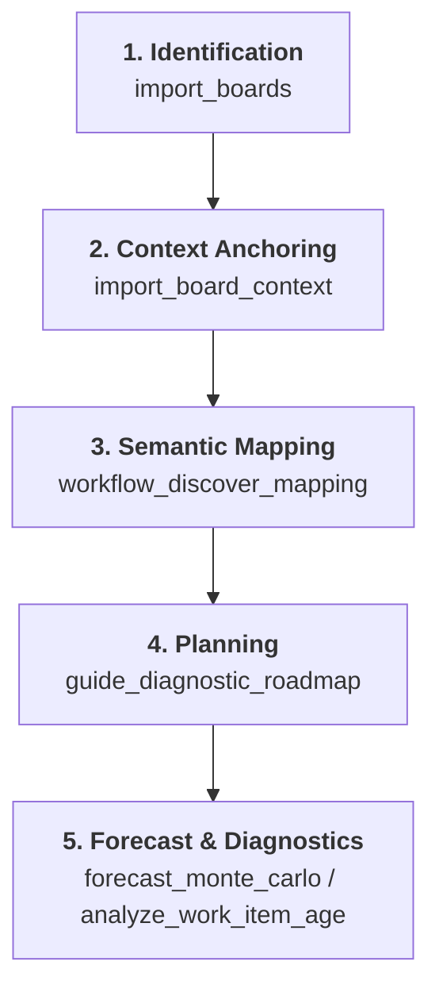
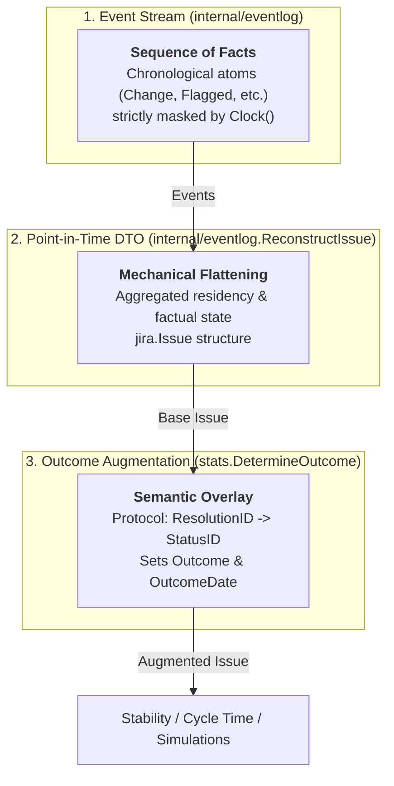

# MCS-MCP Architecture & Operational Manual

This document provides a comprehensive overview of the MCS-MCP (Monte-Carlo Simulation Model Context Protocol) server. It is designed to serve as both a high-level conceptual map and a technical reference for AI agents.

---

## 1. Operational Flow (The Interaction Model)

To achieve reliable forecasts, the interaction with MCS-MCP follows a specific analytical sequence.


```mermaid
graph TD
    A["<b>1. Identification</b><br/>import_boards"] --> B["<b>2. Context Anchoring</b><br/>import_board_context"]
    B --> C["<b>3. Semantic Mapping</b><br/>workflow_discover_mapping"]
    C --> D["<b>4. Planning</b><br/>guide_diagnostic_roadmap"]
    D --> E["<b>5. Forecast & Diagnostics</b><br/>forecast_monte_carlo / analyze_work_item_age"]
```

1. **Identification**: Use `import_projects`/`import_boards` to locate the target.
2. **Context Anchoring**: `import_board_context` performs an **Eager Fetch** of history and stabilizes the project context via the **Data Shape Anchor**.
3. **Semantic Mapping**: `workflow_discover_mapping` uses **Data Archeology** to propose logical process tiers (Demand, Upstream, Downstream, Finished). **AI agents must verify this mapping before proceeding.**
4. **Planning**: `guide_diagnostic_roadmap` recommends a sequence of tools based on the user's goal (e.g., forecasting, bottleneck analysis).
5. **Analytics**: High-fidelity diagnostics (Aging, Stability, Simulation) are performed against confirmed tiers.

---

### 1.1 Tool Directory

A complete reference of all available MCP tools, grouped by category.

#### Data Ingestion

| Tool | Purpose |
| :--- | :--- |
| `import_projects` | Search Jira projects by name or key. |
| `import_boards` | Find Agile boards for a project, with optional name filtering. |
| `import_project_context` | Fetch a Data Shape Anchor (volume and type distribution) for a project-level context. |
| `import_board_context` | Fetch a Data Shape Anchor for a specific board; triggers an Eager Hydration of event history. |
| `import_history_expand` | Extend the cached history backwards (from the OMRC boundary) or catch up forwards (from the NMRC boundary). |
| `import_history_update` | Sync the cache with any Jira updates since the last NMRC. |

#### Workflow Configuration

| Tool | Purpose |
| :--- | :--- |
| `workflow_discover_mapping` | Probe status categories, residency times, and resolutions to propose a semantic workflow mapping (tiers, roles, outcomes). |
| `workflow_set_mapping` | Persist the user-confirmed semantic metadata (tier, role, outcome) for statuses and resolutions. Triggers Discovery Cutoff recalculation. |
| `workflow_set_order` | Define the chronological order of statuses for range-based analytics (CFD, Flow Debt). |
| `workflow_set_evaluation_date` | Inject a specific date for time-travel analysis. Set to empty to return to real-time mode. |

#### Diagnostics

| Tool | Purpose |
| :--- | :--- |
| `analyze_status_persistence` | Identify bottlenecks by analyzing time items spend in each workflow status (P50/P85/P95). |
| `analyze_work_item_age` | Detect aging WIP outliers relative to P85 historical norms. |
| `analyze_throughput` | Analyze weekly delivery volume with XmR stability limits. |
| `analyze_process_stability` | Assess cycle-time predictability using XmR Individual and Moving Range charts. |
| `analyze_flow_debt` | Analyze the balance between commitment arrivals and delivery departures. |
| `analyze_wip_stability` | Analyze WIP population stability via daily run chart with XmR bounds. |
| `analyze_wip_age_stability` | Analyze Total WIP Age stability (cumulative age burden) via daily run chart with XmR bounds. |
| `analyze_process_evolution` | Perform a longitudinal "Strategic Audit" using Three-Way Control Charts. |
| `analyze_yield` | Analyze delivery efficiency (delivered vs. abandoned) attributed to workflow tiers. |
| `analyze_cycle_time` | Calculate Service Level Expectations (SLE) from historical cycle times. |
| `analyze_item_journey` | Get a detailed breakdown of a single item's time across all workflow stages. |
| `generate_cfd_data` | Calculate daily population counts per status and issue type for CFD visualization. |

#### Forecasting

| Tool | Purpose |
| :--- | :--- |
| `forecast_monte_carlo` | Run a Monte-Carlo simulation to forecast a delivery date or volume. |
| `forecast_backtest` | Perform Walk-Forward Analysis (backtesting) to empirically validate forecast accuracy. |

#### Navigation

| Tool | Purpose |
| :--- | :--- |
| `guide_diagnostic_roadmap` | Return a recommended, goal-driven sequence of tools (forecasting, bottlenecks, capacity planning, system health). Returns static guidance; does not examine live data. |

---

## 2. Core analytical Principles: "Fact-Based Archeology"

MCS-MCP rejects reliance on often-misconfigured Jira metadata (like `statusCategory`). Instead, it infers process reality from objective transition logs.

### 2.1 The 4-Tier Meta-Workflow Model

Every status is mapped to a logical process layer to ensure specialized clock behavior:

| Tier           | Meaning                          | Clock Behavior                                        |
| :------------- | :------------------------------- | :---------------------------------------------------- |
| **Demand**     | Unrefined entry point (Backlog). | Clock pending.                                        |
| **Upstream**   | Analysis/Refinement.             | Active clock (Discovery).                             |
| **Downstream** | Actual Implementation (WIP).     | Active clock (Execution).                             |
| **Finished**   | Terminal exit point.             | **Clock Stops**. Duration becomes fixed "Cycle Time". |

### 2.1.1 Backflow & Clock Reset Behavior

A **backflow** occurs when an item transitions to a status whose weight is below the **commitment point** weight — i.e., the item moves backwards past the point where work was considered committed. Backflow is detected purely via weight comparison against the commitment point, not via tier membership, because the commitment point is freely configurable and may sit anywhere in the workflow (including mid-Downstream).

When backflow past the commitment point is detected:

| Metric             | Effect                                                                                                              |
| :----------------- | :------------------------------------------------------------------------------------------------------------------ |
| **Cycle Time**     | Clock resets. Transitions before the last backflow are trimmed; residency recalculated from that point forward.     |
| **WIP Age**        | Clock resets (same policy as Cycle Time). Controlled by `COMMITMENT_POINT_BACKFLOW_RESET_CLOCK` (default: `true`).  |
| **WIP Run Chart**  | Item exits WIP on backflow (same as crossing the delivery point) and re-enters on recommitment.                     |
| **Status Age**     | Unaffected (always measures time in current status only).                                                           |

> **Design Note**: A future enhancement will make the delivery point similarly configurable, allowing operators to freely position both "clock start" and "clock stop" in the workflow.

### 2.2 Discovery Heuristics

- **Birth Status**: The earliest entry point identifies the system's primary source of demand.
- **Terminal Sinks**: Statuses with high entry-vs-exit ratios identify logical completion points even if Jira resolutions are missing.
- **Backbone Order**: The "Happy Path" is derived from the most frequent sequence of transitions (Market-Share confidence > 15%).
- **Unified Regex Stemming**: Automatically links paired statuses (e.g., "Ready for QA" and "In QA") via semantic cores.

---

## 3. Workflow Outcome Alignment (Throughput Integrity)

The server distinguishes **how**, **when**, and **where** work exits the process to ensure throughput accurately reflects value-providing capacity and cycle times are deterministic.

### 3.1 The 2-Step Outcome Protocol (ID-First)

Jira's raw state representation is often too chaotic to be used directly by analytical functions. To protect these functions from signature bloat and recalculation inconsistencies, the core `jira.Issue` struct is explicitly augmented with an `Outcome` (`"delivered"` or `"abandoned"`) and an `OutcomeDate` during the historical reconstruction phase.

This is performed by `stats.DetermineOutcome` using a strict **ID-First** evaluation:

1. **Primary Signal (Explicit ResolutionID):** The system first checks the Jira `ResolutionID`. It must be mapped to an outcome via the `activeResolutions` configuration. If the ID is found, `OutcomeDate` is bound to the issue's `ResolutionDate`. If the `ResolutionID` is not in the map, the system falls back to looking up the resolution's human-readable *name* (`issue.Resolution`) before defaulting to `"delivered"` with a warning log.
2. **Fallback Signal (Workflow Mapping):** If no `ResolutionID` exists, the system checks if the item's current `StatusID` belongs to the `"Finished"` tier. If true, it assigns the Outcome mapped to that Status. The `OutcomeDate` is synthesized by walking backwards through the item's transition history to find the beginning of the current uninterrupted streak in the Finished tier — i.e., the exact moment the item first transitioned into its terminal state.

### 3.2 Downstream Isolation (The "Outcome" Guardrail)

**Crucially, all downstream analytical functions are decoupled from raw Jira metadata.**

Functions that calculate Throughput, Flow Cadence, Cycle-Time, Monte-Carlo simulations, and Stability (XmR) **must solely rely** on `issue.Outcome` and `issue.OutcomeDate`. They do not check `ResolutionDate`, `StatusCategory`, or `Tier` themselves.

- **Throughput & Simulation**: Only aggregates items where `issue.Outcome == "delivered"`. Items mapped as `"abandoned"` (e.g., "Won't Do", "Discarded") are excluded from capacity forecasting but remain vital for Yield Analysis.
- **Cycle Time**: Chronological subtraction is performed against `issue.OutcomeDate` to ensure that items moving silently into "Done" columns are still assigned accurate terminal dates.

### 3.3 Yield Analysis Attribution

The server calculates the "Yield Rate" by attributing abandonment to specific tiers:

- **Heuristic Attribution**: Backtracks through the item's `Transitions` to the last active status if the outcome is `abandoned`.

### 3.4 Workflow Discovery Response Format

`workflow_discover_mapping` returns different content depending on whether a confirmed mapping already exists on disk.

- **`NEWLY_PROPOSED`**: No confirmed mapping was found (or `force_refresh` was requested). The response includes a `workflow.proposed_resolutions` block — a map of every resolution name seen in the sample to its inferred outcome (`"delivered"` or `"abandoned"`). The AI **must** present this proposal to the user for confirmation before calling `workflow_set_mapping`.
- **`LOADED_FROM_CACHE`**: A previously user-confirmed mapping was found on disk with a non-empty status mapping. The cached tiers, order, commitment point, and resolution mapping are returned as-is. The `workflow.proposed_resolutions` block is **omitted**; the AI should simply reconfirm the existing mapping with the user.

The `discovery_source` field in the `diagnostics` envelope carries this value. The `_metadata.is_cached` boolean mirrors it for quick checks.

**Default Resolution Fallbacks (`getResolutionMap`):** When no confirmed mapping exists, the system seeds the discovery heuristics with these name-keyed defaults:

| Resolution Name | Default Outcome |
| :--- | :--- |
| Fixed, Done, Complete, Resolved, Approved | `delivered` |
| Closed, Won't Do, Discarded, Obsolete, Duplicate, Cannot Reproduce, Declined | `abandoned` |

---

## 4. High-Fidelity Simulation Engine

MCS-MCP uses a **Hybrid Simulation Model** that integrates historical capability with current reality.

### 4.1 Three Layers of Accuracy

1. **Statistical Capability**: Builds a throughput distribution using **Delivered-Only** outcomes from a sliding window (default: 180 days).
2. **Current Reality (WIP Analysis)**: Explicitly analyzes the stability and age of in-flight work.
3. **Demand Expansion**: Automatically models the "Invisible Friction" of background work (Bugs, Admin) based on historical type distribution.
4. **Stratified Coordinated Sampling**: Detects and isolates distinct delivery streams to model capacity clashes (Bug-Tax).

### 4.2 Stratified Coordinated Sampling (Advanced Modeling)

The engine can transition from a **Pooled** to a **Stratified** model if work item types show significantly different delivery profiles.

- **Dynamic Eligibility**: Stratification is only enabled if a type has sufficient volume (>15 items) and its Cycle Time variance is >15% from the pooled average. This isolates unstable or bursty processes without over-fitting to sparse data.
- **Capacity Coordination (Preventing the Capacity Fallacy)**: Independent strata are sampled concurrently butcoordinated by a **Daily Capacity Cap** (P95 of historical total throughput). This prevents the "stacking" of independent samples from generating unrealistic velocity that exceeds the team's theoretical limit.
- **The 'Bug-Tax' (Statistical Correlation)**: The engine automatically detects negative correlations between throughput strata. If "Type A" (the Taxer) has high volume on days where "Type B" (the Taxed) is low, the simulation mirrors this constraint, ensuring that an increase in Bugs correctly constrains Story delivery.
- **Bayesian Blending**: For types with sparse historical data, the engine "blends" stratified behavior with the pooled average (30% bias) to maintain statistical stability while honoring unique type attributes.
- **Modeling Transparency**: Every result includes a `modeling_insight` field that discloses if the simulation used a pooled or stratified approach and why.

### 4.3 Standardized Percentile Interpretation

To ensure consistency across simulations, aging, and persistence, the following standardized mapping is used:

| Naming           | Percentile | Meaning                                                 |
| :--------------- | :--------- | :------------------------------------------------------ |
| **Aggressive**   | P10        | Best-case outlier; "A miracle occurred."                |
| **Unlikely**     | P30        | Very optimistic; depends on everything going perfectly. |
| **Coin Toss**    | P50        | Median; 50/50 chance of being right or wrong.           |
| **Probable**     | P70        | Reasonable level of confidence; standard for planning.  |
| **Likely**       | P85        | High confidence; recommended for commitment.            |
| **Conservative** | P90        | Very cautious; accounts for significant friction.       |
| **Safe-bet**     | P95        | Extremely likely; includes heavy tail protection.       |
| **Limit**        | P98        | The practical upper bound of historical data.           |

### 4.4 Simulation Safeguards

To prevent nonsensical forecasts, the engine implements several integrity thresholds:

- **Throughput Collapse Barrier**: If the median simulation result exceeds 10 years, a `WARNING` is issued. This usually indicates that filters (`issue_types` or `resolutions`) have reduced the sample size so much that outliers dominate.
- **Resolution Density Check**: Monitors the ratio of "Delivered" items vs. "Dropped" items. If **Resolution Density < 20%**, a `CAUTION` flag is raised, warning that the throughput baseline may be unrepresentative.

### 4.5 Walk-Forward Analysis (Backtesting)

The system provides `forecast_backtest` to validate the reliability of Monte-Carlo simulations via historical backtesting.

- **Adaptive Validation Batching**: If not provided, the number of items to forecast is automatically set to **2x the median weekly throughput** of the last 10 weeks. This ensures the forecast horizon is always relevant to the team's actual velocity.
- **Overlapping Weekly Steps**: The analysis iterates backwards through history using a **7-day step size** (overlapping windows). This increases diagnostic sensitivity and allows for earlier detection of systemic process shifts.
- **Drift Protection**: Backtesting automatically terminates if a significant process shift is detected via the Three-Way Control Chart, preventing misleading accuracy results.
- **Midnight Alignment**: Analysis dates are truncated to midnight to eliminate "partial-day bias," ensuring that daily-bucketed simulations align with real-world outcomes.
- **Reconstruction Hardening**: The backtesting engine uses terminal status mappings during historical reconstruction to ensure finished items in the past are accurately projected.

---

## 5. Volatility & Predictability Metrics

The server provides statistical dispersion metrics to quantify process stability and risk.

### 5.1 Dispersion Metrics (The Spread)

- **IQR (Interquartile Range)**: P75 - P25. Measures the density of the middle 50%. Smaller = higher predictability.
- **Inner 80%**: P90 - P10. Shows the range where 80% of items fall, providing a robust view of the "middle" without extreme outlier noise.

### 5.2 Volatility Heuristics (The Risk)

| Metric                       | Stable Threshold | Indication of Failure                                                                                                    |
| :--------------------------- | :--------------- | :----------------------------------------------------------------------------------------------------------------------- |
| **Tail-to-Median (P85/P50)** | **<= 3.0**       | **Highly Volatile**: If > 3.0, high-confidence items take >3x the median, indicating heavy-tailed risk.                  |
| **Fat-Tail Ratio (P98/P50)** | **< 5.6**        | **Unstable**: Kanban University heuristic. If >= 5.6, extreme outliers control the process, making forecasts unreliable. |

---

## 6. Stability & Evolution (XmR)

Process Behavior Charts (XmR) assess whether the system is "in control."

- **XmR Individual Chart**: Detects outliers (points above Natural Process Limits) and shifts (8 consecutive points on one side).
- **Three-Way Tactical Audit**: Uses subgroup averages (weekly/monthly) to detect long-term strategic process drift.
- **WIP Age Monitoring**: Compares current WIP against historical limits to provide early warnings of a "Clogged" system.
- **WIP Stability Bounding**: Generates daily WIP run charts bounded by weekly sampled XmR limits to detect Little's Law violations without daily autocorrelation skew.
- **Throughput Cadence (XmR)**: Applies XmR limits to weekly/monthly delivery volumes to detect batching behavior or "Special Cause" surges/dips in capacity.
- **Flow Debt (Arrival vs. Departure)**: Explicitly monitors the gap between items crossing the **Commitment Point** (Arrivals) and items being **Delivered** (Departures). Positive Flow Debt is a leading indicator of WIP inflation and cycle time degradation.
- **Stability Guardrails (System Pressure)**: Automatically calculates the ratio of blocked (Flagged) items in the current WIP. If **Pressure >= 0.25 (25%)**, the system emits a `SYSTEM PRESSURE WARNING`, indicating that historical throughput is an unreliable proxy for the future due to high impediment stress.

---

## 7. Friction Mapping (Impediment Analysis)

MCS-MCP identifies systemic process friction by analyzing "Flagged" events and correlating them with workflow residency.

### 7.1 Methodology: Geometric Intersection

Instead of calculating a prone-to-misuse "Flow Efficiency" ratio, the system identifies absolute signals of impediment:

1. **Interval Extraction**: The system extracts contiguous "Blocked" intervals from the event-sourced log (from `Flagged` to `Unflagged` or terminal status).
2. **Status Segmentation**: The item's journey is divided into discrete status residency segments.
3. **Geometric Intersection**: The system overlays blocked intervals onto status segments. If an item was flagged for 5 days while in "In Development", those 5 days are attributed to that status's `BlockedResidency`.

### 7.2 Impediment Signals

Friction is reported through absolute metrics rather than percentages:

- **Impediment Count (`BlockedCount`)**: The frequency of blocking events within a specific stage.
- **Impediment Depth (`BlockedP50/P85`)**: The typical duration an item remains blocked once an impediment occurs.

This approach provides a high-fidelity "Friction Heatmap" that pinpoint precisely where and for how long teams are held up, without the mathematical noise of efficiency ratios.

---

## 8. Internal Mechanics (The Event-Sourced Engine)

### 8.1 Staged Ingestion & Persistent Cache

- **Event-Sourced Architecture**: The system maintains an immutable, chronological log of atomic events (`Change`, `Created`, `Flagged`, `Unresolved`).
- **Two-Stage Hydration**:
  - **Stage 1 (Recent Updates)**: Fetches the last 1000 items sorted by `updated DESC`.
  - **Stage 2 (Baseline Depth)**: Explicitly fetches resolved items to ensure a minimum baseline (default 200 items).
- **Cache Integrity**:
  - **2-Month Rule**: If the latest cached event is > 2 months old, the system performs a full re-ingestion to clear potential "ghost" items (moved/deleted).
  - **24-Month Horizon**: Initial hydration is bounded to 24 months.
  - **8-Page Cap**: Ingestion is capped at 2400 items to prevent memory exhaustion in legacy projects.
  - **OMRC/NMRC Boundaries**: For targeted extensions, the system uses the Oldest/Newest Most-Recent-Change (OMRC/NMRC) boundary logic to prevent data gaps or overlaps.
  - **Purge-before-Merge**: Targeted extensions replace existing issue histories to ensure Jira deletions or corrections are reflected.
- **Cache Management Tools**:
  - `import_history_expand`: Fetches older items backwards from the **OMRC** boundary and catch-up forward from **NMRC**.
  - `import_history_update`: Syncs the cache with any updates made in Jira since the last **NMRC**.
- **WorkflowMetadata Persistence**: Alongside the event cache, each board's confirmed configuration is persisted to `{cacheDir}/{projectKey}_{boardID}_workflow.json`. This file stores the status mapping (ID → Tier/Role/Outcome), resolution mapping (ID → outcome), status order, commitment point, discovery cutoff, evaluation date, and the `NameRegistry`. A workflow file is considered "loaded from cache" (`isCachedMapping = true`) **only** when the file contains a non-empty status mapping — files created by a background hydration save before user confirmation do not qualify.
- **Dynamic Discovery Cutoff**: Automatically calculates a "Warmup Period" (Dynamic Discovery Cutoff) to exclude noisy bootstrapping periods from analysis. The cutoff is set to the **date of the 5th delivery** after the workflow mapping is confirmed, ensuring the system has demonstrated steady-state delivery capacity before analytical windows are opened. Recalculated automatically whenever `workflow_set_mapping` is called.

### 8.2 The Unified Outcome Protocol

To ensure conceptual integrity and clear separation of concerns, MCS-MCP utilizes a streamlined pipeline for rebuilding the state of work items.


```mermaid
graph TD
    subgraph "1. Event Stream (internal/eventlog)"
        L1["<b>Sequence of Facts</b><br/>Chronological atoms (Change, Flagged, etc.)<br/>strictly masked by Clock()"]
    end
    subgraph "2. Point-in-Time DTO (internal/eventlog.ReconstructIssue)"
        L2["<b>Mechanical Flattening</b><br/>Aggregated residency & factual state<br/>jira.Issue structure"]
    end
    subgraph "3. Outcome Augmentation (stats.DetermineOutcome)"
        L3["<b>Semantic Overlay</b><br/>Protocol: ResolutionID -> StatusID<br/>Sets Outcome & OutcomeDate"]
    end
    L1 -->|Events| L2
    L2 -->|Base Issue| L3
    L3 -->|Augmented Issue| Analytics[Stability / Cycle Time / Simulations]
```

1. **Event Stream**: Chronological extraction of atomic facts. The stream is strictly masked by the app-wide `Clock()`, ensuring 100% deterministic time-travel analysis.
2. **Mechanical Flattening**: Aggregates the event stream into a `jira.Issue` DTO. It calculates raw status residency but ignores workflow meaning.
3. **Outcome Augmentation**: The "Smart" layer. It applies the confirmed project config (Mappings, Resolutions) to determine **how** and **when** the item reached a terminal state. This ensures that downstream algorithms (like Cadence or Monte-Carlo) are decoupled from the noise of inconsistent raw Jira metadata.

### 8.3 Analytical Orchestration (`AnalysisSession`)

To reduce boilerplate and ensure consistency across tools, the system utilizes a centralized **AnalysisSession** (Orchestrator).

- **Encapsulated Pipeline**: The session handles the entire hydration-to-projection pipeline (Context -> Events -> Items -> Filtered Samples).
- **Consolidated Projections**: All analytical projections (Scope, WIP, Throughput) are anchored to the session's temporal window, ensuring that different tools (e.g., Simulation and Aging) ALWAYS operate on the same data snapshot.
- **Windowed Context**: The session maintains the **AnalysisWindow**, providing a single point of truth for "Now" vs "Then" during historical reconstructions.

### 8.4 Strategic Decoupling (Package Boundaries)

The codebase follows a strict acyclic dependency model designed for stability during rapid refactoring:

- **`internal/eventlog`**: The agnostic storage layer. It knows how to transform and persist Jira events but has NO awareness of analytical metrics.
- **`internal/stats`**: The analytical engine. It depends on `eventlog` for data but contains all the business logic for metrics, residency, and projections.
- **`internal/jira`**: The DTO and Mapping layer. Houses the objective Jira domain models and transformation logic.
- **`internal/stats/discovery`**: A specialized sub-package for non-deterministic "Best Guess" workflow heuristics, keeping the core `stats` package focused on pure mathematics.

### 8.5 Discovery Sampling

The active discovery path uses **`ProjectNeutralSample`** (recency-biased): issues are sorted by their latest event timestamp (descending) and the top N are selected. This ensures discovery reflects the **active process** rather than the oldest historical records.

A complementary utility, `SelectDiscoverySample`, implements an **adaptive date-window strategy** (prioritising the last 365 days, expanding to 2–3 years when the priority pool has fewer than 100 items, and strictly excluding items older than 3 years). This function is available for targeted use but is not the primary discovery path.

### 8.6 Backward Boundary Scanning (History Transformation)

To ensure analytical integrity when issues move between projects or change workflows, the system uses a **Backward Boundary Scanning** strategy during transformation:

- **Directionality**: Histories are processed **backwards** from the current state (Truth) towards the birth.
- **Boundary Detection**: The system identifies process boundaries by detecting a change in identity (`Key`) signifying entering the target project.
- **Arrival Anchoring**: The moment a boundary is hit, the scan terminates. The state transition at this boundary defines the item's **Arrival Status** in the target project.
- **Synthetic Birth**: While the Jira `Created` date (Biological Birth) is preserved, the issue is conceptually re-born into the target project at that arrival status. This ensures that its initial duration correctly reflects its time spent in the project's entry point.
- **Throughput Integrity**: The system ignores `Created` events for delivery dating. Throughput is only attributed to true `Change` events (resolutions or terminal status transitions), ensuring moved items are counted at their arrival/completion point rather than their biological birth.

### 8.7 Technical Precision

- **Microsecond Sequencing**: Changlogs are processed with integer microsecond precision for deterministic ordering.
- **Residency**: Residency tracking uses exact seconds (`int64`), converted to days only at the reporting boundary (`Days = seconds / 86400`).
- **Touch-and-Go Automation Filter**: Any status residency under 60 seconds is automatically discarded during persistence analytics. This prevents high-speed Jira automation rules or bulk-transitions from artificially dragging down stage medians with unrepresentative 0-day flow debt.
- **Zero-Day Safeguard**: Current aging metrics are rounded up to the nearest 0.1 to avoid misleading "0.0 days" results.

### 8.8 The ID-First Canonical Key Strategy

To ensure robust data integration and cross-localization compatibility, MCS-MCP implements an "ID-First" architecture for all internal state and processing.

- **Canonical Processing**: Internally, the analytical pipelines (e.g., Residency, CFD, Aging, and Simulations) strictly key off immutable and stable Jira Object IDs (e.g., Status IDs, Resolution IDs). This eliminates mathematical fragility caused by human-readable names changing over time or being returned in the user's native language by the Jira Cloud API.
- **API Boundary Translation**: Human-readable strings are used exclusively at the external API boundaries. When interacting with the AI Agent or the user, the server automatically translates IDs back to their human-readable equivalents (via a bidirectional `NameRegistry`) to ensure discovery, exploration, and generated metrics remain intuitive and conversational.
- **NameRegistry**: The `NameRegistry` struct holds two maps — `Statuses` (status ID → name) and `Resolutions` (resolution ID → name) — with case-insensitive reverse lookups in both directions (`GetStatusID`, `GetStatusName`, `GetResolutionID`, `GetResolutionName`). The registry is populated during every Hydration call and is **persisted inside `WorkflowMetadata`** so that ID↔Name translations survive server restarts without requiring a live Jira connection.
- **Ingress Migration**: When loading a previously saved workflow (`loadWorkflow`), the server performs a migration pass over the stored mappings. Any entry keyed by a human-readable name is re-keyed to its stable ID using `GetStatusID` / `GetResolutionID`. Conversely, any entry with a missing or corrupted `Name` field is healed using `GetStatusName` / `GetResolutionName`. This ensures the on-disk format remains correct even if older versions stored name-keyed entries.

### 8.9 App-Wide Time Injection (Time-Travel Anchoring)

To enable true deterministic testing and allow users to analyze system states as they existed on specific past dates, MCS-MCP implements **App-Wide Time Injection**:

- **Centralized Clock**: The `mcp.Server` abstains from using raw `time.Now()` across its diagnostics, discovery, and forecasting handlers. Instead, it routes time requests through a centralized `Clock() time.Time` method.
- **Runtime Dynamics**: By default, `Clock()` returns real-time `time.Now()`. However, users or AI Agents can call the `workflow_set_evaluation_date` tool to inject a specific `activeEvaluationDate`.
- **Context Persistence**: The evaluation date is persisted in `WorkflowMetadata` (`*_workflow.json`) alongside the board's mapping and resolutions, ensuring that "time-travel" mode survives server reboots.
- **WFA Determinism**: The Walk-Forward Analysis (`WalkForwardConfig`) accepts this injected `EvaluationDate`. In integration testing, the server and the mock-data generator are pinned to the exact same reference date, fully eliminating ISO-week boundary drift and producing 100% deterministic backtest accuracy scores.

### 8.10 Workflow State Lifecycle (Handler Context Strategy)

MCS-MCP uses two distinct strategies for managing server state across handler invocations, separating read-only discovery from state-mutating confirmation.

- **`resolveSourceContext` (Read-Only)**: Performs a stateless JQL/board metadata lookup. It validates the project/board combination and normalises the filter JQL, but does **not** set `s.activeSourceID` or modify any server state. Used by `workflow_discover_mapping` so that discovery can run at any time without forcing a context switch.

- **`anchorContext` (State-Mutating)**: Switches the server's active context to a new project/board. It clears all previously active state (mapping, resolutions, order, commitment point, evaluation date), prunes the in-memory event store to free RAM (`PruneExcept`), and loads the persisted `WorkflowMetadata` from disk for the new source. Short-circuits immediately if the source is already active (`s.activeSourceID == sourceID`). Used by all configuration tools (`workflow_set_mapping`, `workflow_set_order`, `workflow_set_evaluation_date`) **and all diagnostic handlers** (`analyze_flow_debt`, `analyze_process_stability`, `analyze_process_evolution`, etc.) to guarantee that workflow metadata (mapping, commitment point, status order) is always initialised before analysis runs. Without this, a fresh-start diagnostic call would operate on empty state and overwrite the persisted workflow file with that empty state via `saveWorkflow`.

This separation means that browsing or re-running discovery across multiple boards does not corrupt the active analytical context, while all state-mutating and analytical operations are always applied to an explicitly anchored source.

### 8.11 Response Envelope

All tool responses are wrapped in a standard envelope by `WrapResponse`:

```json
{
  "context": { "project_key": "PROJECT", "board_id": 123 },
  "data":    { /* main analytical payload */ },
  "diagnostics": {
    "discovery_source": "NEWLY_PROPOSED | LOADED_FROM_CACHE"
  },
  "guardrails": {
    "warnings": [ "DATA INTEGRITY WARNING: ..." ],
    "insights": [ "NOTE: This is a NEW PROPOSAL..." ]
  }
}
```

- **`data`**: The primary analytical result (metrics, projections, workflow blocks, etc.).
- **`diagnostics`**: Operational metadata specific to the tool invocation (e.g., `discovery_source`, sampling details). Intended for the AI Agent, not the end user.
- **`warnings`**: Data quality flags emitted by the analytical pipeline (e.g., insufficient sample size, system pressure, low resolution density). These may affect the reliability of results and should be surfaced to the user.
- **`insights`**: Strategic guidance for the AI Agent about how to present or act on the result (e.g., `"PREVIOUSLY VERIFIED: This mapping was LOADED FROM DISK"`, `"NOTE: This is a NEW PROPOSAL — verify with the user before proceeding"`).

---

## 9. Data Security & GRC Principles

MCS-MCP is designed with **Security-by-Design** and **Data Minimization** at its core.

### 9.1 Principle: Need-to-Know

The system strictly adheres to the "Need-to-Know" principle by ingests and persisting only the analytical metadata required for flow analysis.

- **Analytical Metadata (Fetched & Persisted)**: Issue Keys, **Issue Types**, Status Transitions, Timestamps, Resolution names, and **Flagged/Blocked history**.
- **Sensitive Content (DROPPED)**: While Jira may return full objects, the ingestion and transformation layer strictly **drops** fields such as **Summary (Title), Description, Acceptance Criteria, and Assignees** at the first processing step.
- **Impact**: This ensures that sensitive information is never exposed to the analytical models, never persisted to the cache, and never made available to the AI Agent.

### 9.2 Principle: Transparency (Auditability)

The system maintains absolute transparency in how data is stored and used.

- **Human-Readable Storage**: Long-term caches (Event Logs, Workflow Metadata) are stored in plain-text JSON/JSONL formats.
- **Auditability**: Security officers can at any time inspect the `cache` directory to verify that no sensitive data has been leaked during the ingestion process.
- **Fact-Based Archeology**: By deriving the workflow from transition logs rather than configuration metadata, the system ensures that the analytical view remains objective and untainted by human-entered (and potentially sensitive) configuration details.

---

## 10. Comprehensive Stratified Analytics

MCS-MCP implements **Type-Stratification** as a core architectural baseline across all diagnostics. This ensures that process insights are not diluted by a heterogeneous mix of work (e.g., mixing 2-day Bugs with 20-day Stories).

### 10.1 The Architecture of Consistency

Every analytical tool in the server has been extended to provide both pooled (system-wide) and stratified (type-specific) results:

| Tool                | Stratified Capability                                                    | Rationale                                                               |
| :------------------ | :----------------------------------------------------------------------- | :---------------------------------------------------------------------- |
| **Monte Carlo**     | Stratified Capacity / Bayesian Blending / correlations.                  | Prevents "Invisibility" of slow items in mixed simulations.             |
| **Cycle Time SLEs** | Full Percentile sets per Work Item Type.                                 | Sets realistic, data-driven expectations for different classes of work. |
| **WIP Aging**       | Type-Aware Staleness Detection (Percentile-based).                       | Prevents false-negative "Clogged" alerts for complex/slow types.        |
| **Stability (XmR)** | Individual & Moving Range limits per Type (Cycle-Time, WIP, Throughput). | Detects special cause variation that is masked in a pooled view.        |
| **Yield Analysis**  | Attribution of Delivery vs. Abandonment per Type.                        | Identifies which work types suffer the most process waste.              |
| **Throughput**      | Delivery cadence with XmR stability limits and flexible bucketing.       | Visualizes and bounds delivery "bandwidth" predictability.              |
| **CFD**             | Provides daily population counts per status and type.                    | Visualizes flow and identifies bottlenecks over time.                   |
| **Flow Debt**       | Arrival Rate vs. Departure Rate comparison.                              | Leading indicator of WIP inflation and future cycle time degradation.   |
| **Residency**       | Status-level residency percentiles (P50..P95) per Type.                  | pinpoints type-specific bottlenecks at the status level.                |

### 10.2 Statistical Integrity Guards

To maintain reliability, stratification follows strict defensive heuristics:

- **Volume Thresholds**: Smaller cohorts are automatically blended with pooled averages using **Bayesian Weighting** to prevent outlier spikes from dominating the analysis.
- **Temporal Alignment**: All stratified time-series (XmR, Cadence) are aligned to the same analytical windows and bucket boundaries (Midnight UTC) to allow for across-tool correlation.
- **Conceptual Coherence**: By using the same work item types and outcome semantics across every tool, the system provides a unified "Process Signature" for the project.

---

## 11. Golden File Integration Testing (Mathematical Hardening)

To guarantee the absolute integrity of statistical and probabilistic projections during refactoring, MCS-MCP relies on an end-to-end **Golden File Integration Testing** framework.

### 11.1 The Adversarial Dataset

Rather than mocking isolated 2-issue scenarios, the test suite injects a massive `simulated_events.json` database into the analytical pipelines.

- **Real-World Origins**: Derived from an anonymized, high-volume production Jira log to ensure authentic process chaos.
- **Edge-Case Injection**: The timeline is deliberately spiked with mathematical anomalies (e.g., fractional-millisecond residency, cyclic status ping-ponging, and zero-throughput gaps) to stress-test division-by-zero guards and aging thresholds.

### 11.2 Deterministic Execution

To ensure byte-for-byte consistency across test runs, the system enforces strict determinism:

- **Simulation Seeding**: The Monte-Carlo Engine receives a fixed random seed (`SetSeed(42)`), disabling entropy so complex distributions can be byte-verified.
- **Temporal Anchoring**: Instead of relative `time.Now()` calculations, functions like `CalculateInventoryAge` accept an injected `evaluationTime`. The testing harness computes the exact maximum timestamp present in the anonymized dataset to serve as the definitive "Now".

### 11.3 Per-Handler Golden Baselines

Each MCP handler has its own golden baseline file under `internal/testdata/golden/mcp/` (e.g., `analyze_cycle_time.json`, `forecast_monte_carlo_scope.json`). The `TestHandlers_Golden` test exercises every analytical handler end-to-end through the full server stack (handler → hydrate → stats → response envelope).

- **Granular Drift Detection**: Each handler's output is compared byte-for-byte against its own baseline. A change in one metric does not obscure changes in another.
- **Selective Regeneration**: Baselines can be regenerated individually or all at once via `go test ./internal/mcp/ -run TestHandlers_Golden -update`.
- **Fixture Integrity**: A SHA-256 hash of `simulated_events.jsonl` is tracked in a sidecar file. When the fixture changes, all baselines must be regenerated.

### 11.4 External Mathematical Verification (Nave Benchmarking)

To ensure universal validity of the internal analytical logic, the system's core metrics have been benchmarked against **Nave**, a reference standard for flow analytics.

- **Throughput Integrity**: Weekly and monthly throughput calculations match the Nave reference engine exactly (100% parity).
- **Cycle Time Precision**: Percentile calculations for Cycle Time (P98, P95, P70, P50, and P30) show near-perfect alignment with Nave's statistical output.
  - **Cycle Time P85 Bias**: Internal P85 calculations for Cycle Time are verified to be approximately 6% higher (more conservative) than Nave's P85. This slight delta is an intentional safeguard to ensure commitments remain robust against minor process variability. (another cause may be one "ghost" item in Nave)
- **WIP/Day Alignment**: Daily Inventory (WIP) levels are verified to be generally very close to Nave's results, with minor fluctuations (occasionally higher or lower) that remain within acceptable analytical bounds.
- **WIP Age Accuracy**: The "WIP Age since commitment" metrics match Nave's results near-perfectly, ensuring reliable aging diagnostics for in-flight work.
- **Monte Carlo Calibration**: For long-range forecasts (e.g., 20 items over 4 months), the internal engine is verified to be slightly more conservative (~1 week longer at P85) than standard external models. This is an intentional result of **Demand Expansion** (modeling historical distributions of background work) and ensures that commitments remain realistic.

> [!IMPORTANT]
> These metrics have been mathematically verified and hardened. Any modification to the underlying statistical functions (`internal/stats` or `internal/simulation`) must be accompanied by a re-verification against these benchmarks and an update to the Golden File baseline.
